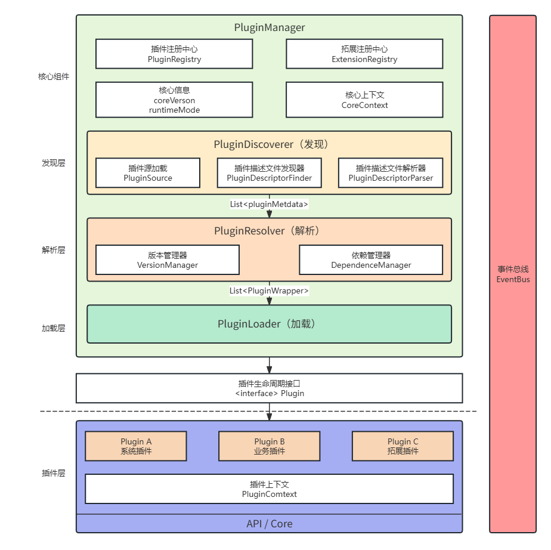

# Nexus Admin

## 项目概述

Nexus Admin 是一个基于微内核（Microkernel）架构的**插件化系统拓展平台**，秉持"插件即业务，拓展即能力"的设计理念，支持系统能力的灵活替换与无限扩展。

系统采用严格微内核模型构建：

- 内核是唯一稳定运行时
- 所有系统能力均以插件形式提供
- 技术框架不进入核心
- 能力可替换：任何系统能力均可通过新插件平滑替代

平台目标：

- **极小核心**：核心保持稳定、长期演进
- **能力外置**：所有可变能力插件化
- **强隔离**：插件之间无直接耦合
- **可替换性**：任何能力可被新插件替代

## 核心特点

- **🔌 完全插件化**：所有系统能力（认证、权限、存储、AI等）均以插件形式提供
- **🧩 统一扩展点**：通过 ExtensionPoint 机制定义标准能力接口
- **🔄 完整生命周期**：支持插件的发现、解析、加载、初始化、启动、停止、卸载、升级
- **🧠 类加载隔离**：每个插件拥有独立的 ClassLoader，避免依赖冲突
- **📊 状态机驱动**：插件状态转换通过状态机管理，保证状态一致性
- **📡 事件驱动**：插件间通过事件总线通信，避免直接依赖

## 架构概览

平台采用分层与模块化设计：

```text
backend/
├─ nexus-admin-core/        # 微内核运行时与插件物理加载实现
├─ nexus-admin-api/         # 业务基础层，提供拓展点定义、内建能力实现与 RESTful API
├─ nexus-admin-app/         # 启动装配层，负责系统装配、框架适配与平台级配置
└─ plugins/                 # 插件实现集合
```

### 模块职责

| 模块 | 职责 |
|------|------|
| nexus-admin-core | 插件生命周期管理、依赖解析、类加载隔离、扩展点注册中心、事件总线 |
| nexus-admin-api | 拓展点接口定义、内建能力实现、RESTful API 与通用工具类 |
| nexus-admin-app | 系统装配与初始化、平台级配置管理、Web 框架适配 |
| plugins | 系统能力的具体实现（认证、权限、存储、AI等） |

### 核心架构



## 用户指南

- [快速开始](docs/user-guid/快速开始.md)

## 项目状态

🚧 **开发进行中**

当前项目处于早期开发阶段，核心架构与插件机制已基本成型，正在逐步完善基础设施的默认实现与示例插件。

## 后续计划

- [ ] 完善基础设施层对主流技术栈（如Redis、MySQL、Spring Security等）的默认适配
- [ ] 提供一系列常用业务插件（如JWT认证、RBAC权限、审计日志等）
- [ ] 开发管理界面，实现对插件的可视化监控与动态管理

---

> Nexus Admin 为系统能力的快速构建与可持续演进提供了一种新的思路——"插件即业务，拓展即能力"。通过微内核架构，让系统既能保持内核的简洁与稳定，又能无限拓展其能力边界。
