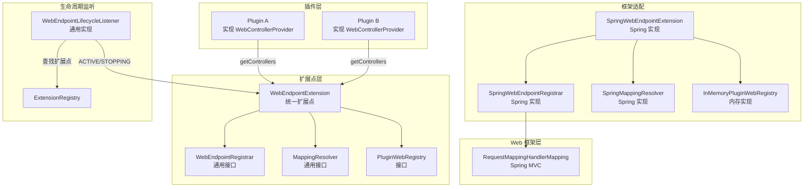
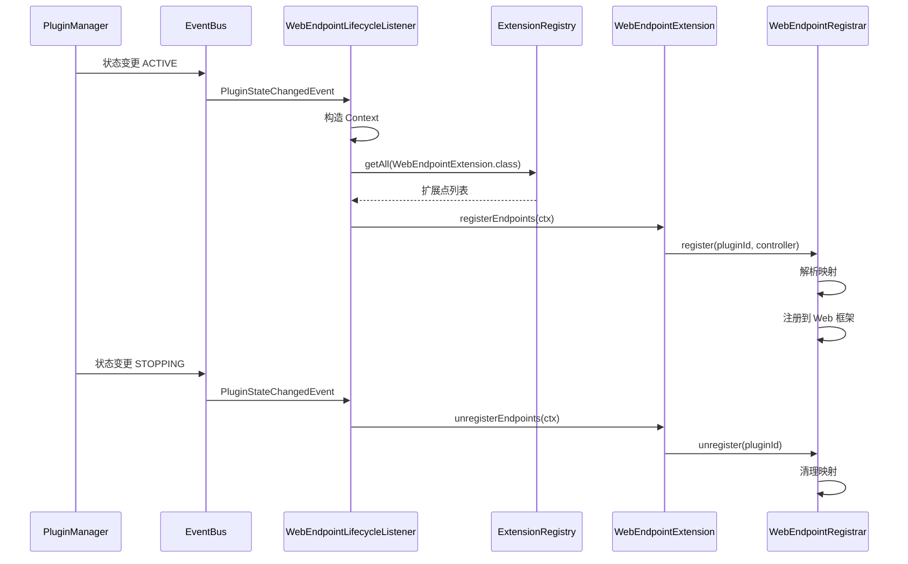

# Web 接入机制

------

## 1. 概述

### 1.1 设计目标

Web 接入机制是 Nexus Admin 插件化架构中实现插件 Web API 动态注册的基础设施，解决插件 Controller 无法被主容器 Web 框架识别的核心问题。

设计目标：

- **动态注册**：让插件中的 Controller 可被外部访问
- **容器隔离**：不污染主容器，保持插件的独立性和可卸载性
- **精确卸载**：支持插件卸载时精确清理已注册的端点
- **路径隔离**：避免不同插件 API 路径冲突
- **框架无关**：Web 接入机制接口不依赖具体 Web 框架，支持未来扩展
- **统一扩展点**：Web 接入机制本身作为扩展点，支持插件定制接入行为

### 1.2 核心原则

- **桥接模式**：不将 Controller 放入主容器，而是通过 HandlerMapping 桥接
- **注册追踪**：通过注册表精确追踪每个插件的映射关系
- **事件驱动**：通过插件状态变更事件触发注册与卸载
- **接口抽象**：核心接口不依赖具体 Web 框架（如 Spring MVC）
- **扩展点统一**：Web 接入机制以单一扩展点 `WebEndpointExtension` 暴露，与其他扩展点风格一致

------

## 2. 问题背景

### 2.1 核心矛盾

插件运行在独立的 ClassLoader 中，主容器 Web 框架仅识别 Root ApplicationContext 中的 Controller，导致插件中定义的 Controller 无法生效。

```text
插件运行在独立 PluginContext（子容器）
        ↓
主容器 Web 框架仅识别 Root ApplicationContext 中的 Controller
        ↓
插件中的 Controller 无法生效
```

### 2.2 设计约束

本设计严格遵循现有系统约束：

1. 已存在完整插件生命周期状态机（不可修改）
2. 已存在 PluginManager / PluginContext / ConfigManager / Facade
3. admin-panel 为普通插件（无特权）
4. 不允许破坏已有核心结构
5. Web 接入机制接口必须通用，不绑定具体 Web 框架

------

## 3. 架构设计

### 3.1 整体架构



### 3.2 组件职责

| 组件 | 职责 | 所在模块 | 说明 |
|------|------|----------|------|
| WebEndpointExtension | Web 接入统一扩展点 | api | 扩展点接口，定义注册/卸载端点契约 |
| SpringWebEndpointExtension | Spring MVC 扩展点实现 | app | 框架特定实现，支持自动扫描 |
| WebEndpointRegistrar | Web 端点注册器接口 | api | 通用接口，定义注册/卸载契约 |
| SpringWebEndpointRegistrar | Spring MVC 端点注册器实现 | app | 框架特定实现 |
| MappingResolver | 映射解析器接口 | api | 通用接口 |
| SpringMappingResolver | Spring MVC 注解解析实现 | app | 框架特定实现 |
| PluginWebRegistry | 插件 Web 端点注册表接口 | api | 存储接口 |
| InMemoryPluginWebRegistry | 内存实现 | app | 基于内存的注册表实现 |
| AdminApi | 管理面板 API 标记注解 | api | 路径策略标记 |
| WebControllerProvider | 控制器提供者接口 | api | 插件实现此接口显式提供 Controller（可选） |
| EnablePluginWebEndpoints | 启用自动扫描注解 | api | 插件标记此注解启用自动扫描 |
| EndpointScanConfig | 自动扫描配置 | api | 描述扫描意图的通用配置 |
| WebEndpointLifecycleListener | 插件生命周期监听器 | app | 通用实现，通过扩展点调度 |

------

## 4. 核心抽象

### 4.1 WebEndpointExtension（统一扩展点）

Web 接入统一扩展点，负责在插件生命周期内为指定插件注册和卸载 Web 端点。

```java
public interface WebEndpointExtension extends ExtensionPoint {

    /**
     * 在插件激活时，为该插件注册所有 Web 端点。
     *
     * @param context 注册上下文
     */
    void registerEndpoints(Context context);

    /**
     * 在插件停止前，为该插件卸载所有已注册的 Web 端点。
     *
     * @param context 注册上下文
     */
    void unregisterEndpoints(Context context);

    record Context(
            String pluginId,
            Object plugin,
            WebControllerProvider controllerProvider,
            WebEndpointRegistrar registrar,
            MappingResolver mappingResolver,
            PluginWebRegistry registry,
            EndpointScanConfig scanConfig
    ) {
    }

    record EndpointScanConfig(
            boolean enabled,
            String[] basePackages
    ) {
    }
}
```

### 4.2 控制器发现机制

Web 接入机制支持两种控制器发现方式：

#### 4.2.1 显式提供（WebControllerProvider）

插件通过实现 `WebControllerProvider` 接口显式提供控制器。该接口不依赖任何具体 Web 框架。

```java
public interface WebControllerProvider {

    /**
     * 获取该插件提供的所有 Web 控制器实例。
     * <p>
     * 返回的控制器对象通常包含 Web 框架相关的注解（如 Spring MVC 的 @RestController）。
     * 平台会根据当前使用的 Web 框架，将这些控制器注册到对应的请求映射系统中。
     *
     * @return 控制器实例列表，如果没有则返回空列表
     */
    List<Object> getControllers();
}
```

**使用示例**：

```java
public class MyPlugin extends AbstractPlugin implements WebControllerProvider {

    @Override
    public List<Object> getControllers() {
        return List.of(new MyController());
    }
}
```

#### 4.2.2 自动扫描（EnablePluginWebEndpoints）

插件通过在主类上标记 `@EnablePluginWebEndpoints` 注解，启用自动扫描机制。平台会自动发现并注册指定包路径下的控制器。

```java
@Target(ElementType.TYPE)
@Retention(RetentionPolicy.RUNTIME)
@Documented
public @interface EnablePluginWebEndpoints {

    /**
     * 要扫描的基础包列表。
     * 未指定时，默认使用插件主类所在包及其子包。
     */
    String[] basePackages() default {};

    /**
     * 通过类推导基础包。
     */
    Class<?>[] basePackageClasses() default {};
}
```

**使用示例**：

```java
@EnablePluginWebEndpoints
public class MyPlugin extends AbstractPlugin {
    // 自动扫描主类所在包及其子包
}
```

或指定扫描包：

```java
@EnablePluginWebEndpoints(basePackages = "com.example.plugin.web")
public class MyPlugin extends AbstractPlugin {
    // 自动扫描指定包
}
```

**两种模式对比**：

| 特性 | WebControllerProvider | EnablePluginWebEndpoints |
|------|----------------------|-------------------------|
| 使用方式 | 实现接口，重写方法 | 添加注解 |
| 控制器创建 | 插件手动创建 | 平台自动扫描并实例化 |
| 依赖注入 | 插件自行处理 | 平台支持构造器注入 |
| 灵活性 | 完全控制创建过程 | 声明式，接近 Spring Boot 体验 |
| 推荐场景 | 需要精细控制时 | 标准 REST API 开发 |

### 4.3 WebEndpointRegistrar（端点注册器接口）

Web 端点注册器接口，负责将插件中的控制器动态注册到当前使用的 Web 框架。

```java
public interface WebEndpointRegistrar {

    /**
     * 为指定插件注册一个控制器提供的所有端点。
     *
     * @param pluginId   插件唯一标识
     * @param controller 控制器实例
     */
    void register(String pluginId, Object controller);

    /**
     * 卸载指定插件注册的所有端点。
     *
     * @param pluginId 插件唯一标识
     */
    void unregister(String pluginId);
}
```

### 4.4 MappingResolver（映射解析器接口）

映射解析器接口，用于从控制器类中解析出请求映射信息。

```java
public interface MappingResolver {

    /**
     * 解析控制器中的所有请求映射。
     *
     * @param controller 控制器实例
     * @param pluginId   插件唯一标识
     * @return 解析后的映射列表
     */
    List<ResolvedMapping> resolve(Object controller, String pluginId);

    record ResolvedMapping(
            Object mappingInfo,
            Object handler,
            Method method
    ) {
    }
}
```

### 4.5 PluginWebRegistry（端点注册表接口）

插件 Web 端点注册表接口，负责追踪每个插件注册的所有 Web 映射。

```java
public interface PluginWebRegistry {

    void add(String pluginId, Object mappingInfo);

    List<Object> get(String pluginId);

    void remove(String pluginId);

    boolean hasMappings(String pluginId);

    int size();

    void clear();
}
```

### 4.6 SpringWebEndpointExtension（扩展点实现）

Spring MVC 下的 Web 接入扩展点实现，支持显式提供和自动扫描两种模式。

```java
@Extension(priority = 50)
public class SpringWebEndpointExtension implements WebEndpointExtension {

    private final ApplicationContext applicationContext;

    public SpringWebEndpointExtension(ApplicationContext applicationContext) {
        this.applicationContext = applicationContext;
    }

    @Override
    public void registerEndpoints(Context ctx) {
        // 1. 处理显式提供的控制器
        registerExplicitControllers(ctx);

        // 2. 处理自动扫描的控制器
        registerScannedControllers(ctx);
    }

    private void registerExplicitControllers(Context ctx) {
        WebControllerProvider provider = ctx.controllerProvider();
        if (provider == null) {
            return;
        }
        for (Object controller : provider.getControllers()) {
            ctx.registrar().register(ctx.pluginId(), controller);
        }
    }

    private void registerScannedControllers(Context ctx) {
        EndpointScanConfig scanConfig = ctx.scanConfig();
        if (!scanConfig.enabled()) {
            return;
        }

        // 使用 Spring 的 ClassPathScanningCandidateComponentProvider 扫描
        ClassPathScanningCandidateComponentProvider scanner =
                new ClassPathScanningCandidateComponentProvider(false);
        scanner.addIncludeFilter(new AnnotationTypeFilter(RestController.class));
        scanner.addIncludeFilter(new AnnotationTypeFilter(Controller.class));

        for (String basePackage : scanConfig.basePackages()) {
            Set<BeanDefinition> candidates = scanner.findCandidateComponents(basePackage);
            for (BeanDefinition bd : candidates) {
                Class<?> controllerClass = Class.forName(bd.getBeanClassName(),
                        false, pluginClassLoader);
                Object controller = instantiateController(controllerClass);
                ctx.registrar().register(ctx.pluginId(), controller);
            }
        }
    }

    private Object instantiateController(Class<?> controllerClass) throws Exception {
        // 优先使用构造器注入：尝试所有参数均可从 ApplicationContext 获取的构造器
        for (Constructor<?> ctor : controllerClass.getConstructors()) {
            Class<?>[] paramTypes = ctor.getParameterTypes();
            Object[] args = new Object[paramTypes.length];
            boolean allResolvable = true;
            for (int i = 0; i < paramTypes.length; i++) {
                try {
                    args[i] = applicationContext.getBean(paramTypes[i]);
                } catch (Exception e) {
                    allResolvable = false;
                    break;
                }
            }
            if (allResolvable) {
                return ctor.newInstance(args);
            }
        }
        // 回退到无参构造器
        return controllerClass.getDeclaredConstructor().newInstance();
    }

    @Override
    public void unregisterEndpoints(Context ctx) {
        ctx.registrar().unregister(ctx.pluginId());
    }
}
```

### 4.7 SpringWebEndpointRegistrar（注册器实现）

Spring MVC Web 端点注册器实现。

```java
public class SpringWebEndpointRegistrar implements WebEndpointRegistrar {

    private final RequestMappingHandlerMapping handlerMapping;
    private final MappingResolver resolver;
    private final PluginWebRegistry registry;

    @Override
    public void register(String pluginId, Object controller) {
        List<ResolvedMapping> mappings = resolver.resolve(controller, pluginId);

        for (ResolvedMapping mapping : mappings) {
            RequestMappingInfo mappingInfo = (RequestMappingInfo) mapping.mappingInfo();
            // 检测路径冲突
            if (hasConflict(mappingInfo)) {
                continue;
            }
            // 注册到 Spring MVC
            handlerMapping.registerMapping(mappingInfo, mapping.handler(), mapping.method());
            registry.add(pluginId, mappingInfo);
        }
    }

    @Override
    public void unregister(String pluginId) {
        List<Object> mappings = registry.get(pluginId);
        for (Object mappingInfo : mappings) {
            handlerMapping.unregisterMapping((RequestMappingInfo) mappingInfo);
        }
        registry.remove(pluginId);
    }
}
```

### 4.8 SpringMappingResolver（解析器实现）

Spring MVC 映射解析器实现。

```java
public class SpringMappingResolver implements MappingResolver {

    private static final String PLUGIN_PATH_PREFIX = "/api";
    private static final String ADMIN_PATH_PREFIX = "/admin";

    @Override
    public List<ResolvedMapping> resolve(Object controller, String pluginId) {
        // 检查 @AdminApi 注解决定路径前缀
        boolean isAdminApi = AnnotatedElementUtils.hasAnnotation(controllerClass, AdminApi.class);
        String pathPrefix = buildPathPrefix(pluginId, isAdminApi);
        // 解析映射并构建 RequestMappingInfo
    }
}
```

### 4.9 InMemoryPluginWebRegistry（注册表实现）

基于内存的插件 Web 端点注册表实现。

```java
public class InMemoryPluginWebRegistry implements PluginWebRegistry {

    private final Map<String, List<Object>> mappings = new ConcurrentHashMap<>();

    @Override
    public void add(String pluginId, Object mappingInfo) {
        mappings.computeIfAbsent(pluginId, k -> new CopyOnWriteArrayList<>()).add(mappingInfo);
    }

    @Override
    public List<Object> get(String pluginId) {
        return mappings.getOrDefault(pluginId, Collections.emptyList());
    }

    @Override
    public void remove(String pluginId) {
        mappings.remove(pluginId);
    }

    @Override
    public boolean hasMappings(String pluginId) {
        List<Object> list = mappings.get(pluginId);
        return list != null && !list.isEmpty();
    }

    @Override
    public int size() {
        return mappings.size();
    }

    @Override
    public void clear() {
        mappings.clear();
    }
}
```

------

## 5. 路径隔离机制

### 5.1 路径策略

为避免不同插件 API 冲突，采用统一前缀策略：

| 类型 | 路径前缀 | 示例 |
|------|----------|------|
| 普通插件 API | `/api/**` | `/api/demo/users` |
| 管理面板 API | `/admin/**` | `/admin/plugins` |

> `SpringMappingResolver.ADMIN_PATH_PREFIX = "/admin"` 与 `PanelWebProperties.basePath` 默认值一致。认证过滤器（`AuthFilter`）和权限拦截器（`PermissionInterceptor`）均基于 `PanelWebProperties.basePath` 决定拦截范围。

### 5.2 @AdminApi 注解

标记 Controller 为管理面板 API，使其映射到 `/admin` 路径前缀。

```java
@Target(ElementType.TYPE)
@Retention(RetentionPolicy.RUNTIME)
@Documented
public @interface AdminApi {
}
```

**使用示例**：

```java
@RestController
@AdminApi
@RequestMapping("/plugins")
public class PluginManageController {
    // 实际访问路径: /admin/plugins

    @GetMapping
    public List<PluginView> listPlugins() {
        // ...
    }
}
```

------

## 6. 生命周期集成

### 6.1 事件驱动注册

通过订阅 `PluginStateChangedEvent` 实现自动注册与卸载。



### 6.2 WebEndpointLifecycleListener

生命周期监听器，负责在插件状态变更时通过扩展点触发注册或卸载。

```java
@Component
public class WebEndpointLifecycleListener {

    private final EventBus eventBus;
    private final ExtensionRegistry extensionRegistry;
    private final WebEndpointRegistrar registrar;
    private final MappingResolver mappingResolver;
    private final PluginWebRegistry registry;

    @PostConstruct
    public void init() {
        eventBus.subscribe(
                PluginStateChangedEvent.class,
                this::onStateChanged,
                EventScopeMatcher.platform(),
                null
        );
    }

    private void onStateChanged(PluginStateChangedEvent event) {
        String pluginId = event.plugin().getPluginId();
        Object plugin = event.plugin().plugin();
        WebControllerProvider provider = (plugin instanceof WebControllerProvider p) ? p : null;
        EndpointScanConfig scanConfig = buildScanConfig(plugin);

        WebEndpointExtension.Context ctx = new WebEndpointExtension.Context(
                pluginId, plugin, provider, registrar, mappingResolver, registry, scanConfig
        );

        List<WebEndpointExtension> extensions = extensionRegistry.getAll(WebEndpointExtension.class);

        switch (event.to()) {
            case ACTIVE -> extensions.forEach(ext -> ext.registerEndpoints(ctx));
            case STOPPING -> extensions.forEach(ext -> ext.unregisterEndpoints(ctx));
            default -> { }
        }
    }

    private EndpointScanConfig buildScanConfig(Object plugin) {
        Class<?> pluginClass = plugin.getClass();
        EnablePluginWebEndpoints ann = pluginClass.getAnnotation(EnablePluginWebEndpoints.class);
        if (ann == null) {
            return new EndpointScanConfig(false, new String[0]);
        }

        List<String> packages = new ArrayList<>();
        for (String pkg : ann.basePackages()) {
            if (pkg != null && !pkg.isBlank()) {
                packages.add(pkg);
            }
        }
        for (Class<?> cls : ann.basePackageClasses()) {
            if (cls != null) {
                String pkg = cls.getPackageName();
                if (pkg != null && !pkg.isBlank()) {
                    packages.add(pkg);
                }
            }
        }
        if (packages.isEmpty()) {
            packages.add(pluginClass.getPackageName());
        }

        return new EndpointScanConfig(true, packages.toArray(String[]::new));
    }
}
```
```

------

## 7. 错误处理

### 7.1 映射冲突检测

注册前检测路径是否与已有映射冲突：

```java
private boolean hasConflict(RequestMappingInfo mappingInfo) {
    var handlerMethods = handlerMapping.getHandlerMethods();
    for (var entry : handlerMethods.entrySet()) {
        RequestMappingInfo existingInfo = entry.getKey();
        var newPatterns = mappingInfo.getPatternsCondition().getPatterns();
        var existingPatterns = existingInfo.getPatternsCondition().getPatterns();
        for (String newPattern : newPatterns) {
            if (existingPatterns.contains(newPattern)) {
                return true;
            }
        }
    }
    return false;
}
```

### 7.2 注册失败策略

- 检测到冲突时跳过该 Controller，记录警告日志
- 注册失败时记录错误日志，不阻断其他 Controller 注册
- 卸载失败时记录警告日志，继续清理其他映射

### 7.3 卸载安全

- 必须保证 mapping 全部移除
- 通过 PluginWebRegistry 追踪所有注册信息
- 插件卸载时强制清理，避免残留

------

## 8. Spring 自动配置

### 8.1 WebEndpointAutoConfiguration

Spring 配置类，负责装配 Web 接入机制的核心组件。

```java
@Configuration
public class WebEndpointAutoConfiguration {

    @Bean
    public PluginWebRegistry pluginWebRegistry() {
        return new InMemoryPluginWebRegistry();
    }

    @Bean
    public MappingResolver mappingResolver() {
        return new SpringMappingResolver();
    }

    @Bean
    public WebEndpointRegistrar webEndpointRegistrar(
            RequestMappingHandlerMapping handlerMapping,
            MappingResolver resolver,
            PluginWebRegistry registry) {
        return new SpringWebEndpointRegistrar(handlerMapping, resolver, registry);
    }

    @Bean
    public WebEndpointExtension webEndpointExtension() {
        return new SpringWebEndpointExtension();
    }
}
```

------

## 9. 设计优势

### 9.1 统一扩展点

Web 接入机制以单一扩展点 `WebEndpointExtension` 暴露，与其他扩展点风格一致，支持插件定制接入行为。同时支持显式提供和自动扫描两种控制器发现模式，满足不同场景需求。

### 9.2 完整插件隔离

插件 Controller 不进入主容器，保持 ClassLoader 级别的隔离。

### 9.3 支持卸载

通过 PluginWebRegistry 精确追踪映射关系，插件卸载时可完整清理。

### 9.4 兼容现有架构

不修改核心生命周期模型、状态机和 PluginManager。

### 9.5 框架无关

核心接口（WebEndpointExtension、WebEndpointRegistrar、MappingResolver、WebControllerProvider、EnablePluginWebEndpoints、PluginWebRegistry）不依赖具体 Web 框架，支持未来扩展：

- 适配其他 Web 框架（如 Vert.x、Quarkus）
- 网关化路由
- 分布式 control plane
- 动态路由策略

------

## 10. 总结

Web 接入机制通过扩展点模式实现了插件 Controller 的动态注册：

1. **统一扩展点**：WebEndpointExtension 作为唯一扩展点，支持插件定制
2. **双模式发现**：支持显式提供（WebControllerProvider）和自动扫描（EnablePluginWebEndpoints）两种控制器发现方式
3. **接口抽象**：核心接口不依赖具体 Web 框架，支持多种实现
4. **桥接模式**：通过 HandlerMapping 桥接，不污染主容器
5. **注册追踪**：精确追踪映射关系，支持安全卸载
6. **路径隔离**：统一前缀策略避免冲突
7. **事件驱动**：与插件生命周期无缝集成

Web 接入机制与插件系统、事件系统、扩展点系统共同构成了 Nexus Admin 插件化架构的 Web 服务能力基础。
