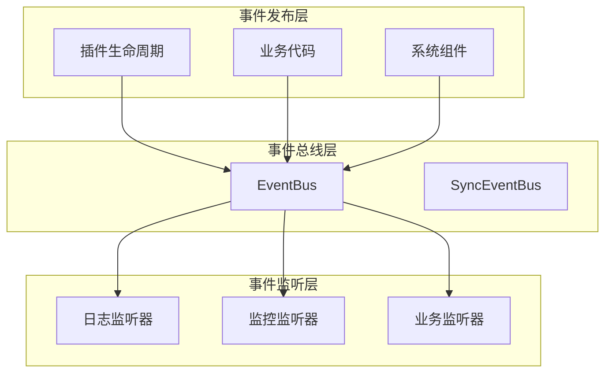

# 事件系统

------

## 1. 概述

### 1.1 设计目标

事件系统是 Nexus Admin 插件化架构的核心基础设施，提供插件间、插件与平台间的解耦通信机制。

设计目标：

- **解耦通信**：插件间不直接依赖，通过事件进行交互
- **生命周期感知**：通过事件监听插件状态变化
- **可观测性**：支持全生命周期监控、审计和日志
- **扩展性**：支持自定义事件类型和监听器

### 1.2 核心原则

- **发布订阅模式**：事件发布者无需知道订阅者存在
- **同步/异步可选**：默认同步实现，支持异步扩展
- **类型安全**：事件类型化，监听器按类型订阅
- **插件级隔离**：支持按插件ID管理订阅

------

## 2. 架构设计

### 2.1 核心组件



### 2.2 组件职责

| 组件 | 职责 | 所在模块 |
|------|------|----------|
| Event | 事件基类，所有事件继承此类 | core |
| EventBus | 事件总线接口，定义发布订阅契约 | core |
| SyncEventBus | 同步事件总线实现 | core |
| EventListener | 事件监听器接口 | core |
| EventPublisher | 事件发布者接口（API层） | api |
| PluginEvent | 插件事件基类 | core |

------

## 3. 核心抽象

### 3.1 Event（事件基类）

所有事件的父类，定义事件的基本属性。

```java
public abstract class Event {
    private final Instant occurredAt;  // 事件发生时间
    
    protected Event() {
        this.occurredAt = Instant.now();
    }
}
```

### 3.2 EventBus（事件总线接口）

```java
public interface EventBus {
    /**
     * 发布事件
     */
    void publish(Event event);

    /**
     * 订阅指定类型事件
     */
    <T extends Event> void subscribe(Class<T> type, EventListener<T> listener);

    /**
     * 注销监听器
     */
    void unsubscribe(EventListener<?> listener);

    /**
     * 按插件ID注销所有监听器
     */
    void unsubscribeByPlugin(String pluginId);
}
```

### 3.3 EventListener（事件监听器接口）

```java
public interface EventListener<T extends Event> {
    void onEvent(T event);
}
```

### 3.4 SyncEventBus（同步实现）

默认的同步事件总线实现：

- 使用 `ConcurrentHashMap` 存储类型到监听器列表的映射
- 使用 `CopyOnWriteArrayList` 保证遍历安全
- 事件按订阅顺序同步处理
- 适合对顺序有要求的场景

------

## 4. 插件生命周期事件

### 4.1 事件类型

| 事件类 | 说明 | 触发时机 |
|--------|------|----------|
| PluginStateChangedEvent | 状态变更事件 | 插件状态迁移时 |
| PluginProcessEvent | 批处理阶段事件 | 发现/解析/加载/删除阶段 |
| PluginFailureEvent | 失败事件 | 插件处理异常时 |

### 4.2 PluginStateChangedEvent

```java
public final class PluginStateChangedEvent extends PluginEvent {
    private final PluginWrapper plugin;    // 插件包装对象
    private final PluginState from;        // 源状态
    private final PluginState to;          // 目标状态
    private final Instant occurredAt;      // 发生时间
}
```

### 4.3 PluginProcessEvent

```java
public final class PluginProcessEvent extends PluginEvent {
    public enum Phase { DISCOVER, RESOLVE, LOAD, DELETE }
    public enum Stage { START, END }
    
    private final Phase phase;      // 处理阶段
    private final Stage stage;      // 阶段状态
    private final int count;        // 处理数量
}
```

### 4.4 事件与生命周期集成

事件总线与插件生命周期紧密集成：

- 状态迁移时自动发布 `PluginStateChangedEvent`
- 批处理阶段发布 `PluginProcessEvent`
- 异常时发布 `PluginFailureEvent`
- 插件卸载时自动清理其订阅的监听器

------

## 5. 使用场景

### 5.1 日志记录

监听生命周期事件，记录插件全生命周期轨迹。

### 5.2 监控告警

监听失败事件，触发告警通知。

### 5.3 审计追踪

记录插件操作历史，支持审计需求。

### 5.4 扩展处理

在特定阶段执行自定义逻辑，如数据同步、缓存刷新等。

------

## 6. 设计约束

### 6.1 事件处理规范

- 监听器应快速处理事件，避免阻塞事件总线
- 耗时操作应异步执行或使用独立线程
- 监听器应处理异常，避免影响其他监听器

### 6.2 订阅管理

- 插件卸载时自动清理其订阅的监听器
- 支持手动注销监听器，避免内存泄漏
- 相同事件类型可注册多个监听器

------

## 7. 总结

事件系统是插件化架构的神经系统：

1. **解耦通信**：插件间通过事件交互，无需直接依赖
2. **生命周期感知**：通过事件监听插件状态变化
3. **可观测性**：支持监控、日志、审计等需求
4. **可扩展性**：支持自定义事件和监听器

事件系统与插件生命周期、扩展点注册中心共同构成了 Nexus Admin 的核心基础设施。
