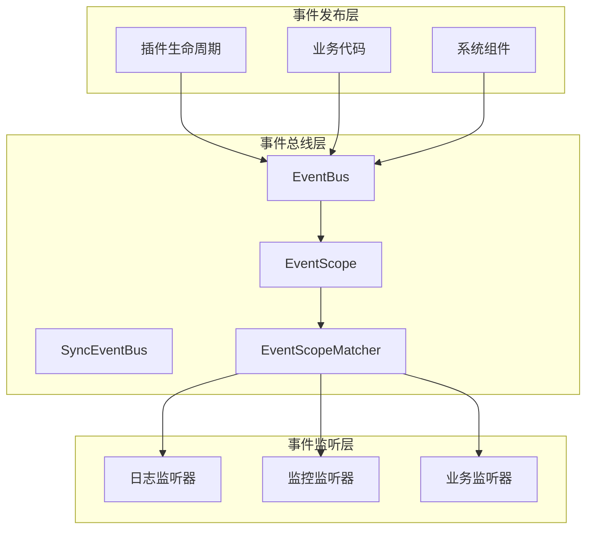

# 事件系统

------

## 1. 概述

### 1.1 设计目标

事件系统是 Nexus Admin 插件化架构的核心基础设施，提供插件间、插件与平台间的解耦通信机制。

设计目标：

- **解耦通信**：插件间不直接依赖，通过事件进行交互
- **作用域隔离**：通过事件作用域实现事件的精确路由与隔离
- **生命周期感知**：通过事件监听插件状态变化
- **可观测性**：支持全生命周期监控、审计和日志
- **扩展性**：支持自定义事件类型和监听器

### 1.2 核心原则

- **发布订阅模式**：事件发布者无需知道订阅者存在
- **作用域机制**：事件携带作用域信息，订阅者按需匹配
- **同步/异步可选**：默认同步实现，支持异步扩展
- **类型安全**：事件类型化，监听器按类型订阅
- **插件级隔离**：支持按插件ID管理订阅

------

## 2. 架构设计

### 2.1 核心组件



### 2.2 组件职责

| 组件 | 职责 | 所在模块 |
|------|------|----------|
| Event | 事件基类，携带作用域信息 | core |
| EventScope | 事件作用域，标识事件所属逻辑空间 | core |
| EventScopeMatcher | 作用域匹配器，订阅时指定接收范围 | core |
| EventBus | 事件总线接口，定义发布订阅契约 | core |
| SyncEventBus | 同步事件总线实现，支持作用域分发 | core |
| EventListener | 事件监听器接口 | core |
| EventPublisher | 事件发布者接口（API层） | api |
| PluginEvent | 插件事件基类，使用平台作用域 | core |
| ExtensionChangedEvent | 扩展点变更事件，在扩展实现注册/注销时由 DefaultExtensionRegistry 发布 | core |
| EventBusRuntime | 事件总线运行时，以 Builder 模式装配 EventBus 默认实例 | core |
| EventBusFacade | 事件总线门面，聚合 EventBus 提供统一的发布与订阅入口 | core |

------

## 3. 核心抽象

### 3.1 EventScope（事件作用域）

事件作用域标识事件所属的逻辑空间，由分类(category)和标识符(identifier)组成。

```java
public final class EventScope {
    private final String category;    // global、platform、plugin、tenant
    private final String identifier;  // 标识符，如插件ID、租户ID
}
```

**标准作用域分类**：

| 分类 | 说明 | 使用场景 |
|------|------|----------|
| global | 全局作用域 | 所有订阅者可见的系统级事件 |
| platform | 平台作用域 | 平台核心功能、平台配置变更 |
| plugin | 插件作用域 | 特定插件的私有事件 |
| tenant | 租户作用域 | 多租户场景下的租户级事件 |

**创建作用域**：

```java
// 全局作用域
EventScope.global()

// 平台作用域
EventScope.platform()

// 插件作用域
EventScope.plugin("system-user")

// 租户作用域
EventScope.tenant("tenant-001")

// 自定义作用域
EventScope.custom("domain", "order")
```

### 3.2 EventScopeMatcher（作用域匹配器）

用于订阅时指定接收哪些作用域的事件。

```java
// 匹配所有作用域
EventScopeMatcher.all()

// 精确匹配指定作用域
EventScopeMatcher.exact(EventScope.platform())

// 匹配指定分类
EventScopeMatcher.category("plugin")

// 匹配指定插件
EventScopeMatcher.plugin("system-user")

// 匹配所有插件
EventScopeMatcher.anyPlugin()

// 匹配平台作用域
EventScopeMatcher.platform()

// 组合匹配器
EventScopeMatcher.plugin("system-user")
    .or(EventScopeMatcher.platform())
```

### 3.3 Event（事件基类）

所有事件的父类，定义事件的基本属性和作用域。

```java
public abstract class Event {
    private final String id;           // 事件唯一标识
    private final Instant timestamp;   // 事件发生时间戳
    private final EventScope scope;    // 事件作用域

    // 默认使用全局作用域
    protected Event() {
        this(EventScope.global());
    }

    // 指定作用域
    protected Event(EventScope scope) {
        // ...
    }
}
```

### 3.4 EventBus（事件总线接口）

```java
public interface EventBus {
    /**
     * 发布事件，根据事件作用域进行匹配分发
     */
    void publish(Event event);

    /**
     * 订阅指定类型的事件，接收所有作用域
     */
    default <T extends Event> void subscribe(Class<T> type, EventListener<T> listener) {
        subscribe(type, listener, EventScopeMatcher.all(), null);
    }

    /**
     * 订阅指定类型和作用域的事件
     */
    <T extends Event> void subscribe(Class<T> type, EventListener<T> listener,
                                     EventScopeMatcher scopeMatcher, String pluginId);

    /**
     * 取消订阅指定监听器
     */
    void unsubscribe(EventListener<?> listener);

    /**
     * 取消指定插件注册的所有监听器
     */
    void unsubscribeByPlugin(String pluginId);
}
```

### 3.5 SyncEventBus（同步实现）

默认的同步事件总线实现：

- 使用 `ConcurrentHashMap` 存储类型到监听器列表的映射
- 使用 `CopyOnWriteArraySet` 保证遍历安全
- 根据 `EventScopeMatcher` 进行作用域匹配
- 事件按订阅顺序同步处理
- 支持事件继承（父类事件监听器也会收到子类事件）

------

## 4. 插件生命周期事件

### 4.1 事件类型

| 事件类 | 说明 | 触发时机 | 作用域 |
|--------|------|----------|--------|
| PluginStateChangedEvent | 状态变更事件 | 插件状态迁移时 | platform |
| PluginProcessEvent | 批处理阶段事件 | 发现/解析/加载/删除阶段 | platform |
| PluginFailureEvent | 失败事件 | 插件处理异常时 | platform |
| PluginUpgradeEvent | 升级事件 | 插件升级时 | platform |
| ExtensionChangedEvent | 扩展点变更事件 | 扩展实现注册/注销时 | platform |

**ExtensionChangedEvent 字段说明**：

| 字段 | 类型 | 说明 |
|------|------|------|
| pointType | Class\<? extends ExtensionPoint\> | 变更的扩展点类型 |
| changeType | ChangeType | 变更类型：REGISTERED（已注册）、UNREGISTERED（已注销）、CLEARED（已清空） |
| implementation | ExtensionPoint | 变更的实现实例，CLEARED 时为 null |

ExtensionChangedEvent 使用平台作用域（`EventScope.platform()`），由 DefaultExtensionRegistry 在扩展注册/注销/清空操作完成后发布。

### 4.2 事件作用域

所有插件生命周期事件统一使用 **平台作用域**（`EventScope.platform()`），表示由平台核心发布。

```java
public abstract class PluginEvent extends Event {
    protected PluginEvent(String pluginId) {
        super(EventScope.platform());  // 使用平台作用域
        this.pluginId = pluginId;
    }
}
```

### 4.3 订阅插件事件

```java
// 订阅平台作用域的插件状态变更事件
eventBus.subscribe(
    PluginStateChangedEvent.class,
    this::onStateChanged,
    EventScopeMatcher.platform(),
    null
);
```

------

## 5. 使用场景

### 5.1 插件发布事件

```java
// 定义插件私有事件
public class UserCreatedEvent extends Event {
    private final String userId;

    public UserCreatedEvent(String pluginId, String userId) {
        super(EventScope.plugin(pluginId));  // 使用插件作用域
        this.userId = userId;
    }
}

// 在插件中发布事件
eventPublisher.publish(new UserCreatedEvent("system-user", userId));
```

### 5.2 插件订阅自身事件

```java
// 订阅本插件作用域的事件
eventBus.subscribe(
    UserCreatedEvent.class,
    event -> { /* 处理事件 */ },
    EventScopeMatcher.plugin("system-user"),
    "system-user"
);
```

### 5.3 平台订阅所有插件事件

```java
// 订阅所有插件作用域的事件（用于监控/审计）
eventBus.subscribe(
    PluginEvent.class,
    event -> { /* 记录日志或监控 */ },
    EventScopeMatcher.category("plugin"),
    "platform"
);
```

### 5.4 日志记录

监听生命周期事件，记录插件全生命周期轨迹。

### 5.5 监控告警

监听失败事件，触发告警通知。

### 5.6 审计追踪

记录插件操作历史，支持审计需求。

------

## 6. 设计约束

### 6.1 事件处理规范

- 监听器应快速处理事件，避免阻塞事件总线
- 耗时操作应异步执行或使用独立线程
- 监听器应处理异常，避免影响其他监听器

### 6.2 订阅管理

- 插件卸载时自动清理其订阅的监听器
- 支持手动注销监听器，避免内存泄漏
- 相同事件类型可注册多个监听器

### 6.3 作用域使用规范

- 平台核心事件使用 `EventScope.platform()`
- 插件私有事件使用 `EventScope.plugin(pluginId)`
- 全局事件使用 `EventScope.global()`
- 租户事件使用 `EventScope.tenant(tenantId)`

------

## 7. 与配置中心作用域的关系

事件系统的作用域与配置中心的作用域采用统一的命名规范：

| 分类 | 事件系统 | 配置中心 |
|------|----------|----------|
| 全局 | `EventScope.global()` | `global` |
| 平台 | `EventScope.platform()` | `platform` |
| 插件 | `EventScope.plugin(id)` | `plugin:{id}` |
| 租户 | `EventScope.tenant(id)` | `tenant:{id}` |

详细规范请参考《作用域》设计文档。

------

## 8. 总结

事件系统是插件化架构的神经系统：

1. **作用域隔离**：通过 EventScope 实现事件的精确路由
2. **解耦通信**：插件间通过事件交互，无需直接依赖
3. **生命周期感知**：通过事件监听插件状态变化
4. **可观测性**：支持监控、日志、审计等需求
5. **可扩展性**：支持自定义事件和监听器

事件系统与插件生命周期、扩展点注册中心、配置中心共同构成了 Nexus Admin 的核心基础设施。
