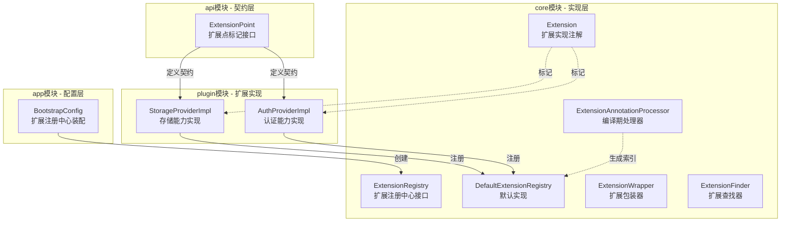
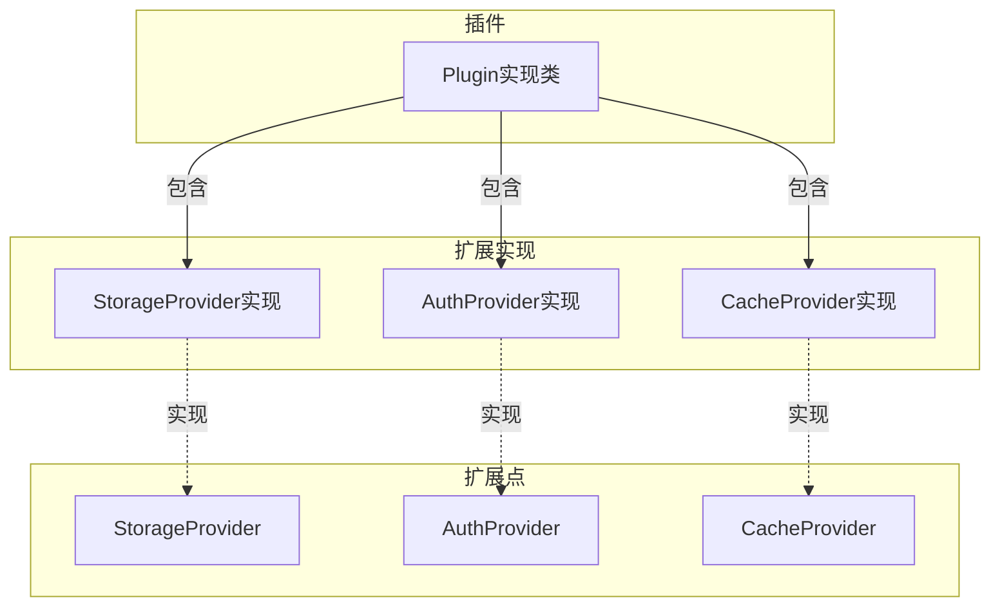

# 拓展点系统

------

## 1. 概述

### 1.1 设计目标

拓展点注册中心是插件化架构的核心基础设施，负责统一管理平台上所有可扩展的能力点（ExtensionPoint）及其实现。其设计目标包括：

- **统一治理**：所有扩展能力由单一注册中心管理，避免分散管理带来的复杂性
- **多实现支持**：同一扩展点可存在多个实现，支持优先级排序和动态选择
- **插件生命周期绑定**：扩展实现与插件生命周期绑定，插件卸载时自动清理其注册的扩展
- **可扩展性**：新增扩展点类型无需修改注册中心核心代码
- **线程安全**：支持并发环境下的安全注册与查询

### 1.2 核心原则

- **契约优先**：扩展点通过接口定义契约，实现类遵循契约编程
- **显式声明**：扩展实现通过注解显式声明，支持编译期索引和运行期发现
- **优先级驱动**：数值越大优先级越高，同优先级后注册者优先
- **插件级隔离**：按插件ID管理扩展，支持插件级生命周期管理
- **零依赖核心**：注册中心实现不依赖外部框架

------

## 2. 架构设计

### 2.1 分层结构



### 2.2 核心抽象

#### 2.2.1 ExtensionPoint（扩展点标记接口）

所有可被插件扩展的能力接口都应继承此接口，以声明其为一个正式的扩展点。

```java
package com.nexusadmin.core.extension;

/**
 * 扩展点标记接口。
 * 所有可被插件扩展的能力接口都应继承此接口。
 */
public interface ExtensionPoint {
}
```

扩展点是插件系统中允许自定义功能的正式声明位置，是平台能力与插件实现之间的契约边界。

典型扩展点包括：

- StorageProvider（存储能力）
- AuthProvider（认证能力）
- CacheProvider（缓存能力）
- LogProvider（日志能力）
- PermissionProvider（权限能力）
- AiModelProvider（AI能力）
- RouteProvider（路由能力）

------

#### 2.2.2 Extension（扩展实现注解）

用于标记扩展点实现类，支持自动发现、优先级配置和扩展点推断。

```java
@Retention(RetentionPolicy.RUNTIME)
@Target(ElementType.TYPE)
@Documented
public @interface Extension {

    /**
     * 显式声明实现的扩展点接口，为空则自动推断
     */
    Class<? extends ExtensionPoint>[] points() default {};

    /**
     * 优先级，值越大优先级越高
     */
    int priority() default 0;

    /**
     * 是否启用该扩展实现
     */
    boolean enabled() default true;

    /**
     * 扩展名称，用于UI展示
     */
    String name() default "";

    /**
     * 扩展描述
     */
    String description() default "";
}
```

**属性说明**：

| 属性 | 说明 |
|------|------|
| points | 显式声明实现的扩展点接口，为空则自动推断 |
| priority | 优先级，值越大优先级越高 |
| enabled | 是否启用该扩展实现 |
| name | 扩展名称，用于UI展示 |
| description | 扩展描述 |

------

#### 2.2.3 ExtensionRegistry（扩展注册中心接口）

定义扩展注册中心的核心能力，包括注册、注销、查询等操作。

```java
public interface ExtensionRegistry {

    /**
     * 注册扩展实现，使用默认优先级 0
     */
    <T extends ExtensionPoint> void register(Class<T> pointType, T implementation);

    /**
     * 注册扩展实现，指定优先级
     */
    <T extends ExtensionPoint> void register(Class<T> pointType, T implementation, int priority);

    /**
     * 注销指定扩展实现
     */
    <T extends ExtensionPoint> void unregister(Class<T> pointType, T implementation);

    /**
     * 获取单个最高优先级实现
     */
    <T extends ExtensionPoint> Optional<T> get(Class<T> pointType);

    /**
     * 获取所有实现（按优先级降序）
     */
    <T extends ExtensionPoint> List<T> getAll(Class<T> pointType);

    /**
     * 按插件ID批量注销（插件卸载时使用）
     */
    void unregisterByPluginId(String pluginId);

    /**
     * 清空指定类型的所有扩展
     */
    <T extends ExtensionPoint> void clear(Class<T> pointType);

    /**
     * 清空所有扩展
     */
    void clearAll();
}
```

**核心能力**：

- 按扩展点类型注册实现（支持优先级）
- 获取单个最高优先级实现
- 获取所有实现（按优先级排序）
- 注销指定实现
- 按插件ID批量注销（插件卸载时使用）
- 清空指定类型或全部扩展

**优先级规则**：

- 数值越大优先级越高
- 相同优先级时后注册者优先（通过序列号保证）

------

#### 2.2.4 DefaultExtensionRegistry（默认实现）

基于线程安全的并发集合实现，支持优先级排序和插件级生命周期管理。

```java
public class DefaultExtensionRegistry implements ExtensionRegistry {

    private static final class RegisteredExtension {
        private final Object implementation;   // 实现实例
        private final int priority;            // 优先级
        private final long sequence;           // 注册序列号（用于同优先级排序）
        private final String pluginId;         // 所属插件ID
    }

    // 扩展点类型到注册扩展列表的映射
    private final ConcurrentHashMap<Class<? extends ExtensionPoint>, 
            CopyOnWriteArrayList<RegisteredExtension>> registry;

    // 插件ID到其注册扩展列表的映射，用于插件卸载时清理
    private final ConcurrentHashMap<String, List<RegisteredExtension>> pluginExtensions;

    private static final AtomicLong SEQUENCE = new AtomicLong(0);
}
```

**数据结构**：

- `registry`: 扩展点类型到注册扩展列表的映射
- `pluginExtensions`: 插件ID到其注册扩展列表的映射，用于插件卸载时清理
- `SEQUENCE`: 全局注册序号，用于相同优先级时的排序

------

#### 2.2.5 ExtensionWrapper（扩展包装器）

封装扩展实现实例及其元信息，用于统一管理和排序。

```java
public final class ExtensionWrapper<T extends ExtensionPoint> implements Comparable<ExtensionWrapper<?>> {
    private final T instance;           // 扩展实现实例
    private final Class<T> pointType;   // 扩展点类型
    private final String pluginId;      // 所属插件ID
    private final int priority;         // 优先级
    private final boolean enabled;      // 是否启用
    private final String name;          // 扩展名称
    private final String description;   // 扩展描述
    private final long sequence;        // 注册序列号
}
```

------

#### 2.2.6 ExtensionFinder（扩展查找器）

用于在指定类加载器中查找扩展点实现。

```java
public interface ExtensionFinder {
    
    <T extends ExtensionPoint> List<ExtensionWrapper<T>> find(
            Class<T> pointType,
            ClassLoader classLoader,
            String pluginId);
    
    default <T extends ExtensionPoint> List<ExtensionWrapper<T>> find(
            Class<T> pointType,
            ClassLoader classLoader) {
        return find(pointType, classLoader, null);
    }
}
```

------

## 3. 组件职责划分

| 组件 | 职责 | 所在模块 |
|------|------|----------|
| ExtensionPoint | 扩展点标记接口，定义能力契约 | api |
| Extension | 扩展实现标记注解 | core |
| ExtensionRegistry | 扩展注册中心接口定义 | core |
| DefaultExtensionRegistry | 扩展注册中心默认实现 | core |
| ExtensionWrapper | 扩展实现包装器 | core |
| ExtensionFinder | 扩展查找器接口 | core |
| ExtensionAnnotationProcessor | 编译期扩展索引生成 | core |
| BootstrapConfig | 应用层装配配置 | app |

------

## 4. 扩展机制

新增扩展点步骤：定义接口（继承 ExtensionPoint）→ 实现扩展（使用 @Extension 注解）→ 注册实现 → 使用扩展。详见 [自定义拓展点](../../user-guid/自定义拓展点.md)。

多实现优先级管理：当同一扩展点存在多个实现时，系统按优先级选择。数值越大优先级越高，相同优先级时后注册者优先。

------

## 5. 配置方式

### 5.1 基础装配

在应用配置层创建并配置扩展注册中心：

```java
@Configuration
public class BootstrapConfig {

    @Bean
    public ExtensionRegistry extensionRegistry() {
        return new DefaultExtensionRegistry();
    }
}
```

### 5.2 扩展实现注册

扩展实现的注册方式：

**方式一：手动注册**

```java
extensionRegistry.register(StorageProvider.class, new S3StorageProvider(), 100);
```

**方式二：通过注解自动发现**

编译期通过 `ExtensionAnnotationProcessor` 扫描 `@Extension` 注解，生成扩展索引文件，运行期自动加载。

```java
@Extension(points = AuthProvider.class)
public class TestPoint implements AuthProvider {
    @Override
    public AuthResult authenticate(AuthRequest request, InvocationContext context) {
        // 实现逻辑
        return null;
    }
}
```

------

## 6. 线程安全设计

`DefaultExtensionRegistry` 采用以下线程安全策略：

- `ConcurrentHashMap`: 存储类型到实现集合的映射
- `CopyOnWriteArrayList`: 存储实现列表，保证读操作无锁
- `AtomicLong`: 生成全局注册序号

设计保证：

- 并发注册安全
- 读取过程无锁遍历
- 返回不可变集合防止外部修改

------

## 7. 设计约束与实践规范

### 7.1 扩展点设计规范

- 所有扩展点接口必须继承 `ExtensionPoint`
- 接口职责单一，避免聚合多种语义
- 接口设计应稳定，避免频繁变更
- 参数和返回值应使用标准类型或DTO

### 7.2 扩展实现规范

- 使用 `@Extension` 注解标记实现类
- 显式声明 `points` 属性，或确保实现类只实现一个扩展点
- 合理设置 `priority`，避免优先级混乱
- 实现类应保持无状态或线程安全

### 7.3 优先级策略建议

| 场景 | 优先级建议 | 说明 |
|------|-----------|------|
| 默认实现 | 50 | 中等优先级 |
| 覆盖实现 | 100 | 高优先级，覆盖默认行为 |
| 兜底实现 | 0-25 | 低优先级，作为备选 |
| 测试实现 | 200 | 最高优先级，用于测试覆盖 |

### 7.4 注册规范

- 组件注册集中在应用配置层或插件启动时
- 禁止在组件内部自行完成注册
- 插件卸载时必须清理其注册的扩展
- 优先使用注解方式声明扩展，减少手动注册

------

## 8. 扩展点与插件的关系

### 8.1 关系模型



### 8.2 使用场景

| 场景 | 说明 |
|------|------|
| 单插件单扩展 | 一个插件提供一个扩展点实现 |
| 单插件多扩展 | 一个插件提供多个扩展点实现 |
| 多插件单扩展 | 多个插件提供同一扩展点的不同实现 |
| 插件无扩展 | 插件仅使用平台能力，不提供扩展 |

------

扩展注册中心与插件生命周期集成：插件启动时注册扩展，停止时自动注销。通过 `pluginId` 关联扩展与插件，支持插件级生命周期管理。

本架构形成了以 `ExtensionRegistry` 为核心的统一扩展管理体系，实现了平台能力与插件实现的清晰分离，为系统提供可预测、可扩展、可治理的扩展基础设施能力。


