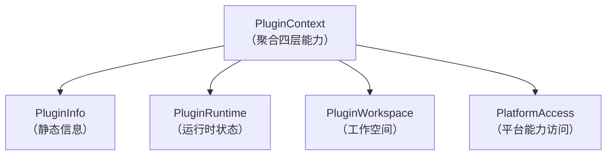

# 插件上下文

------

## 1. 概述

### 1.1 设计目标

插件上下文（PluginContext）是插件与平台交互的统一入口，采用分层模型设计，实现插件与平台的完全解耦。其设计目标包括：

- **能力聚合**：将插件所需的平台能力统一封装，避免插件直接依赖核心实现
- **分层隔离**：通过四层模型清晰划分不同类型的能力访问
- **状态受控**：插件对平台状态的访问是只读的，防止插件破坏平台状态
- **工作空间隔离**：每个插件拥有独立的工作空间目录，互不干扰

### 1.2 核心原则

- **不可变性**：上下文对象创建后不可修改，保证线程安全
- **按需访问**：插件仅通过上下文获取所需能力，禁止直接访问 PluginManager
- **分层职责**：每层只暴露特定类型的能力，职责单一明确
- **无循环依赖**：上下文不持有 PluginWrapper，避免与插件加载层循环依赖

------

## 2. 四层模型架构

### 2.1 模型概览



### 2.2 分层职责

| 层级 | 职责 | 包含内容 |
|------|------|----------|
| PluginInfo | 静态元数据 | 插件描述符、类加载器、物理路径 |
| PluginRuntime | 运行时状态 | 状态查询、活跃性检查 |
| PluginWorkspace | 运行时工作空间 | 配置、数据、缓存、日志目录管理，懒加载创建 |
| PlatformAccess | 平台能力 | 扩展注册中心、事件发布、运行模式 |

------

## 3. 核心组件

### 3.1 PluginContext

上下文聚合根，提供对四层能力的访问入口。

```java
public final class PluginContext {
    private final PluginInfo info;
    private final PluginRuntime runtime;
    private final PluginWorkspace workspace;
    private final PlatformAccess platform;

    public PluginInfo info();
    public PluginRuntime runtime();
    public PluginWorkspace workspace();
    public PlatformAccess platform();
}
```

**设计约束**：

- 类为 final，防止被继承篡改
- 所有字段为 final，保证不可变性
- 通过构造函数一次性注入所有依赖

------

### 3.2 PluginInfo

封装插件的静态元数据，这些信息在插件加载后保持不变。

```java
public final class PluginInfo {
    private final PluginDescriptor descriptor;
    private final ClassLoader classLoader;
    private final Path physicalPath;

    public String id();
    public String version();
    public PluginDescriptor descriptor();
    public ClassLoader classLoader();
    public Path physicalPath();
}
```

**使用场景**：

- 获取插件基本信息（ID、版本）
- 加载插件内部的类或资源
- 定位插件物理位置

------

### 3.3 PluginRuntime

提供对插件运行时状态的动态查询能力。

```java
public final class PluginRuntime {
    public PluginState state();
    public boolean isActive();
    public boolean isDisabled();
    public boolean isStarting();
    public boolean isInitialized();
}
```

**设计特点**：

- 通过 Supplier 实时获取状态，不缓存
- 状态查询是只读的，插件无法修改自身状态
- 提供便捷的状态检查方法

------

### 3.4 PluginWorkspace

插件运行时工作空间，提供插件私有文件目录的结构化访问能力。

```java
public final class PluginWorkspace {
    public Path root();
    public Path resolve(String path);
    public Path config();
    public Path data();
    public Path cache();
    public Path logs();
    public boolean exists();
    public void delete();
}
```

**工作空间目录结构**：

```
plugins-data/
    workspace/
        <plugin-id>/
            config/
            data/
            cache/
            logs/
```

| 目录 | 用途 |
|------|------|
| config | 插件配置文件 |
| data | 插件运行数据 |
| cache | 插件缓存 |
| logs | 插件日志 |

**懒加载机制**：

- Workspace 创建时不会立即创建目录
- 首次访问任意目录方法（`root()`、`config()` 等）时，自动创建根目录及所有标准子目录
- 使用 double-checked locking 保证多线程安全
- `exists()` 方法不会触发初始化

------

### 3.5 PlatformAccess

提供插件与平台核心能力交互的入口。

```java
public final class PlatformAccess {
    public ExtensionRegistry extensions();
    public EventPublisher events();
    public RuntimeMode runtimeMode();
    public String coreVersion();
    public boolean isDevelopment();
    public boolean isDeployment();
}
```

**能力说明**：

| 方法 | 说明 |
|------|------|
| extensions() | 访问扩展注册中心，注册或获取扩展实现 |
| events() | 发布事件到平台事件总线 |
| runtimeMode() | 获取当前运行模式（开发/部署） |
| coreVersion() | 获取平台核心版本号 |

------

## 4. 上下文创建

### 4.1 创建时机

PluginContext 由 PluginManager 在插件初始化前创建，生命周期如下：

```
插件加载完成 (LOADED)
        ↓
创建 PluginContext
        ↓
调用 onInitialize(context)
        ↓
状态变为 INITIALIZED
```

### 4.2 创建流程

```java
protected PluginContext createPluginContext(PluginWrapper wrapper) {
    // 1. 构建四层模型
    PluginInfo info = new PluginInfo(
        wrapper.descriptor(),
        wrapper.classLoader(),
        wrapper.physicalPath()
    );

    PluginRuntime runtime = new PluginRuntime(wrapper::state);

    // 2. Workspace 采用懒加载，首次访问时才创建目录
    PluginWorkspace workspace = new PluginWorkspace(
        pluginsDataRoot.resolve("workspace").resolve(wrapper.getPluginId())
    );

    PlatformAccess platform = new PlatformAccess(
        extensionRegistry,
        eventBus::publish,
        runtimeMode,
        coreVersion
    );

    return new PluginContext(info, runtime, workspace, platform);
}
```

------

## 5. 使用方式

### 5.1 在插件中访问上下文

```java
public class MyPlugin implements Plugin {

    @Override
    public void onInitialize(PluginContext context) throws Exception {
        // 获取插件信息
        String pluginId = context.info().id();
        String version = context.info().version();
    }

    @Override
    public void onStart(PluginContext context) throws Exception {
        // 访问工作空间（首次访问时自动创建目录）
        Path configFile = context.workspace().config().resolve("settings.json");

        // 注册扩展实现
        context.platform().extensions().register(
            StorageProvider.class,
            new MyStorageProvider()
        );

        // 发布事件
        context.platform().events().publish(
            new MyPluginStartedEvent()
        );
    }

    @Override
    public void onStop(PluginContext context) throws Exception {
        // 检查当前状态
        if (context.runtime().isActive()) {
            // 执行清理
        }
    }
}
```

### 5.2 访问路径对比

| 能力 | 旧方式 | 新方式 |
|------|--------|--------|
| 扩展注册中心 | `context.extensionRegistry()` | `context.platform().extensions()` |
| 事件发布 | `context.eventPublisher()` | `context.platform().events()` |
| 运行模式 | `context.runtimeMode()` | `context.platform().runtimeMode()` |
| 物理路径 | `context.physicalPath()` | `context.info().physicalPath()` |
| 类加载器 | `context.classLoader()` | `context.info().classLoader()` |
| 插件状态 | `context.getState()` | `context.runtime().state()` |
| 工作空间 | `context.storage().dataDirectory()` | `context.workspace().data()` |

------

## 6. 设计约束

### 6.1 插件使用规范

- 禁止缓存 PluginContext 中的可变对象（如状态）
- 禁止将上下文传递给插件外部的代码
- 禁止在 onUnload 之后访问上下文

### 6.2 平台保证

- 同一插件实例的生命周期方法传入相同的 PluginContext 实例
- 上下文创建失败会导致插件初始化失败
- 插件卸载时上下文会被清理，不保留引用

------

## 7. 与相关系统的关系

### 7.1 与插件系统的关系

PluginContext 是插件系统的一部分，由 PluginManager 创建和管理。详见 [插件系统](插件系统.md)。

### 7.2 与插件生命周期的关系

上下文在 INITIALIZED 状态前创建，在 UNLOADED 状态后清理。详见 [插件生命周期](插件生命周期.md)。

### 7.3 与拓展点系统的关系

插件通过 `context.platform().extensions()` 访问拓展点注册中心。详见 [拓展点系统](拓展点系统.md)。

------

## 8. 总结

### 核心设计

1. **四层模型**：静态信息、运行时状态、工作空间、平台能力清晰分离
2. **不可变性**：上下文对象创建后不可修改，保证线程安全
3. **懒加载 Workspace**：插件工作空间目录在首次访问时按需创建，避免无用 I/O
4. **职责单一**：每层只负责特定类型的能力访问

### 架构优势

- **解耦彻底**：插件不依赖任何核心实现类
- **可测试性**：易于为插件编写单元测试，可 Mock 上下文
- **可演进性**：四层模型可独立演进，不影响插件代码
- **安全性**：受控的能力暴露，防止插件破坏平台状态
