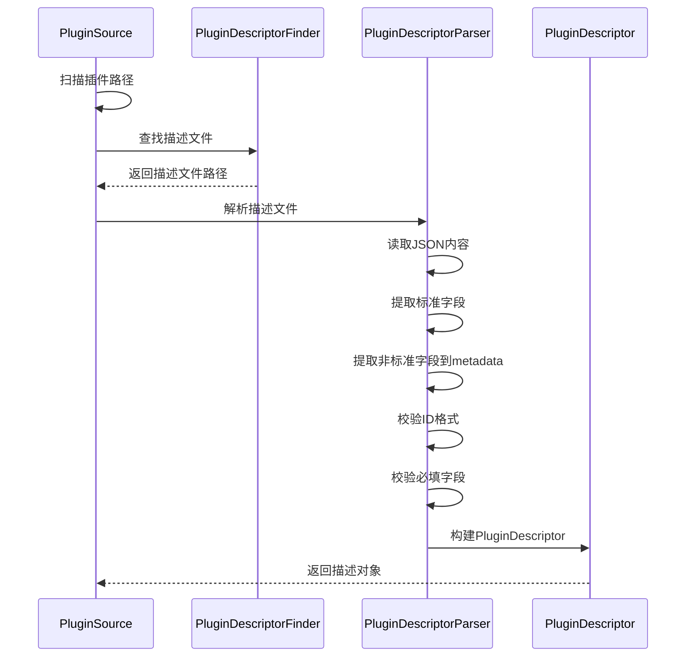

# 插件描述文件

------

## 1. 概述

### 1.1 目的

本文档定义 Nexus Admin 平台的插件描述文件规范，统一插件元数据结构，支持插件的自动发现、加载、依赖管理和版本控制。

### 1.2 适用范围

- 所有 Nexus Admin 插件开发者
- 平台核心维护人员
- 插件市场/仓库集成方

### 1.3 文件位置

插件描述文件必须位于插件资源的 `META-INF/plugin.json` 路径：

- 对于目录形式插件：`插件目录/META-INF/plugin.json`
- 对于 JAR 形式插件：`JAR包内/META-INF/plugin.json`

------

## 2. 文件格式

### 2.1 格式规范

- **文件格式**：JSON（RFC 8259）
- **编码**：UTF-8
- **扩展名**：`.json`

### 2.2 字段分类

| 分类           | 说明                                      |
| -------------- | ----------------------------------------- |
| **必填字段**   | 插件加载的必要条件，缺失将导致加载失败    |
| **可选字段**   | 增强插件描述，缺失时使用默认值            |
| **元数据字段** | 非标准字段自动归入 metadata，支持未来扩展 |

------

## 3. 字段定义

### 3.1 必填字段

#### id

- **类型**：`string`
- **约束**：必须符合正则 `^[a-zA-Z][a-zA-Z0-9._\-]{1,127}$`
- **说明**：插件唯一标识，建议使用反向域名命名法
- **示例**：`"com.company.myplugin"`、`"system-user"`

#### version

- **类型**：`string`
- **约束**：非空字符串，建议使用语义化版本（SemVer）
- **说明**：插件版本号
- **示例**：`"1.0.0"`、`"2.1.0-beta.1"`

### 3.2 可选字段

#### name

- **类型**：`string`
- **默认值**：空字符串
- **说明**：插件显示名称，用于UI展示
- **示例**：`"用户管理插件"`

#### description

- **类型**：`string`
- **默认值**：空字符串
- **说明**：插件功能描述
- **示例**：`"提供用户增删改查及权限管理功能"`

#### author

- **类型**：`string`
- **默认值**：空字符串
- **说明**：插件作者信息
- **示例**：`"Nexus Team"`、`"author@example.com"`

#### mainClass

- **类型**：`string`
- **默认值**：空字符串
- **说明**：插件入口类全限定名，实现 `Plugin` 接口
- **示例**：`"com.nexusadmin.plugin.system.user.SystemUserPlugin"`

#### coreVersion

- **类型**：`string`
- **默认值**：空字符串
- **说明**：支持的平台核心版本范围，使用语义化版本范围语法
- **示例**：
  - `"^1.0.0"` - 兼容 1.x.x 但不兼容 2.0.0
  - `"~1.2.3"` - 兼容 1.2.x 但不兼容 1.3.0
  - `">=1.0.0 <2.0.0"` - 明确范围

#### dependencies

- **类型**：`object`（Map）
- **默认值**：空对象 `{}`
- **说明**：依赖的其他插件，key 为插件ID，value 为版本范围
- **示例**：

```json
{
  "core-auth": "^1.0.0",
  "plugin-b": "~2.0.0",
  "plugin-c": ">=1.0.0"
}
```

#### requires

- **类型**：`object`（Map）
- **默认值**：空对象 `{}`
- **说明**：运行环境要求，如JDK版本、操作系统等
- **示例**：

```json
{
  "jdk": ">=17",
  "os": ["linux", "windows"],
  "memory": "512m"
}
```

### 3.3 元数据字段

任何非标准字段将被自动提取到 `metadata` 中，以支持：

- 插件市场的自定义属性
- 第三方扩展
- 向后兼容

------

## 4. 完整示例

### 4.1 最小配置示例

```json
{
  "id": "hello-world",
  "version": "1.0.0"
}
```

### 4.2 完整配置示例

```json
{
  "id": "com.nexusadmin.plugin.user",
  "version": "2.1.0",
  "name": "用户管理插件",
  "description": "提供用户增删改查、权限分配及登录认证功能",
  "author": "Nexus Team <team@nexusadmin.com>",
  "mainClass": "com.nexusadmin.plugin.user.UserPlugin",
  "coreVersion": "^1.0.0",
  "dependencies": {
    "core-auth": "^1.2.0",
    "core-permission": "~1.0.0"
  },
  "requires": {
    "jdk": ">=17",
    "database": ["mysql", "postgresql"]
  },
  "customField": "自定义值"
}
```

------

## 5. 数据模型

### 5.1 Java 模型（PluginDescriptor）

`PluginDescriptor` 类位于 `com.nexusadmin.core.plugin.discovery` 包（core 模块）。

```java
public final class PluginDescriptor {
    private final String id;                    // 插件唯一标识
    private final String version;               // 版本号
    private final String name;                  // 插件名称
    private final String description;           // 插件描述
    private final String author;                // 作者信息
    private final String mainClass;             // 入口类
    private final String coreVersion;           // 核心版本要求
    private final Map<String, String> dependencies;  // 依赖插件
    private final Map<String, Object> requires;      // 环境要求
    private final Map<String, Object> metadata;      // 扩展元数据
}
```

| 属性           | 类型                  | 说明         |
| -------------- | --------------------- | ------------ |
| `id`           | `String`              | 插件唯一标识 |
| `version`      | `String`              | 版本号       |
| `name`         | `String`              | 插件名称     |
| `description`  | `String`              | 插件描述     |
| `author`       | `String`              | 作者信息     |
| `mainClass`    | `String`              | 入口类       |
| `coreVersion`  | `String`              | 核心版本要求 |
| `dependencies` | `Map<String, String>` | 依赖插件     |
| `requires`     | `Map<String, Object>` | 环境要求     |
| `metadata`     | `Map<String, Object>` | 扩展元数据   |

### 5.2 常量定义（PluginDescriptorKeys）

| 常量               | 值               | 说明             |
| ------------------ | ---------------- | ---------------- |
| `KEY_ID`           | `"id"`           | ID字段键名       |
| `KEY_VERSION`      | `"version"`      | 版本字段键名     |
| `KEY_NAME`         | `"name"`         | 名称字段键名     |
| `KEY_DESCRIPTION`  | `"description"`  | 描述字段键名     |
| `KEY_AUTHOR`       | `"author"`       | 作者字段键名     |
| `KEY_MAIN_CLASS`   | `"mainClass"`    | 主类字段键名     |
| `KEY_CORE_VERSION` | `"coreVersion"`  | 核心版本字段键名 |
| `KEY_DEPENDENCIES` | `"dependencies"` | 依赖字段键名     |
| `KEY_REQUIRES`     | `"requires"`     | 环境要求字段键名 |
| `STANDARD_KEYS`    | 数组             | 所有标准字段集合 |

------

## 6. 解析规则

### 6.1 字段提取规则

1. **标准字段**：按名称直接映射到 `PluginDescriptor` 对应属性
2. **非标准字段**：自动归入 `metadata` Map
3. **空值处理**：可选字段缺失或为空时，使用空字符串/空集合
4. **类型校验**：类型不匹配时抛出 `DescriptorParseException`

### 6.2 ID 格式校验

插件ID必须符合正则表达式：`^[a-zA-Z][a-zA-Z0-9._\-]{1,127}$`

- 必须以字母开头
- 可包含字母、数字、点号、横线或下划线
- 长度限制：2-128 字符
- 支持类似 `com.company.myplugin` 的命名空间格式

### 6.3 依赖解析规则

- `dependencies` 必须为 JSON Object 类型
- 每个依赖项的 value 必须为字符串类型的版本范围
- 非字符串值将被忽略

### 6.4 版本范围语法

支持语义化版本范围：

| 符号 | 含义         | 示例                        |
| ---- | ------------ | --------------------------- |
| `^`  | 兼容次要版本 | `^1.2.3` → `>=1.2.3 <2.0.0` |
| `~`  | 兼容补丁版本 | `~1.2.3` → `>=1.2.3 <1.3.0` |
| `>`  | 大于         | `>1.0.0`                    |
| `>=` | 大于等于     | `>=1.0.0`                   |
| `<`  | 小于         | `<2.0.0`                    |
| `<=` | 小于等于     | `<=2.0.0`                   |

------

## 7. 错误处理

### 7.1 必填字段缺失

```json
{
  "id": "my-plugin"
}
```

**错误**：`DescriptorParseException: plugin.json 缺失必填字段: id 或 version`

### 7.2 ID 格式非法

```json
{
  "id": "123-invalid",
  "version": "1.0.0"
}
```

**错误**：`DescriptorParseException: 插件ID格式非法: 123-invalid（必须匹配正则: ^[a-zA-Z][a-zA-Z0-9._\-]{1,127}$）`

### 7.3 JSON 语法错误

**错误**：`DescriptorParseException: JSON 语法错误: ...`

------

## 8. 向后兼容性

### 8.1 版本演进策略

- **新增可选字段**：向后兼容，旧插件无需修改
- **新增必填字段**：需要升级插件
- **废弃字段**：保留解析但标记为废弃，给予过渡期

### 8.2 元数据扩展

鼓励使用 `metadata` 进行自定义扩展，避免标准字段膨胀：

```json
{
  "id": "my-plugin",
  "version": "1.0.0",
  "metadata": {
    "vendor": "ACME Corp",
    "license": "MIT",
    "homepage": "https://example.com"
  }
}
```

------

## 9. 解析流程



------

## 10. 多环境支持

### 10.1 开发环境

开发环境下，插件以目录形式存在：

```
plugins/
└── my-plugin/
    ├── src/
    ├── pom.xml
    └── META-INF/
        └── plugin.json
```

使用 `DevDirectoryFinder` 查找描述文件。

### 10.2 生产环境

生产环境下，插件以 JAR 形式存在：

```
plugins/
├── my-plugin-1.0.0.jar
│   └── META-INF/
│       └── plugin.json
└── another-plugin/
    └── META-INF/
        └── plugin.json
```

使用 `JarFinder` 或 `PackedDirectoryFinder` 查找描述文件。

------

## 11. 总结

插件描述文件是插件系统的入口，其设计遵循以下原则：

1. **简洁必要**：仅包含必要的元数据信息
2. **向后兼容**：支持字段的平滑演进
3. **可扩展**：通过 metadata 支持自定义字段
4. **严格校验**：对关键字段进行格式校验
5. **多环境**：支持开发和生产环境的差异
