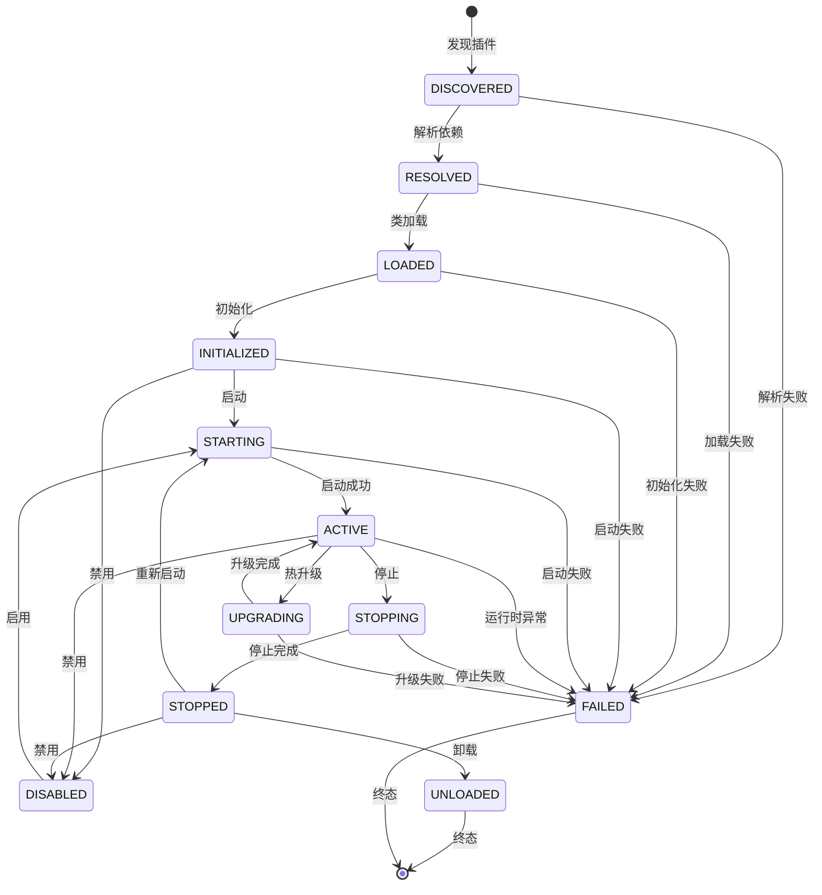

# 插件生命周期

------

## 1. 概述

### 1.1 设计目标

本文档定义 Nexus Admin 平台插件系统的完整生命周期模型，明确插件从发现到卸载的完整状态流转过程。

设计目标：

- **状态清晰**：每个状态有明确的语义边界和进入条件
- **流转可控**：状态迁移遵循严格的规则，避免非法跳转
- **阶段完整**：覆盖发现、解析、加载、初始化、运行、停止、卸载、升级、禁用等全场景
- **异常处理**：明确定义失败状态和错误恢复机制

### 1.2 核心原则

- **显式状态**：所有状态都是显式定义的，不存在隐式状态
- **过渡态与稳定态分离**：过渡态表示正在进行的状态迁移，稳定态表示可停留的状态
- **失败可追踪**：任何阶段都可能进入 FAILED 状态，保留失败上下文
- **禁用不影响元数据**：被禁用的插件仍可参与依赖解析和拓扑排序

------

## 2. 状态定义

### 2.1 PluginState 枚举

```java
public enum PluginState {
    // 启动阶段
    DISCOVERED,     // 已发现（仅元数据）
    RESOLVED,       // 冲突、依赖解析完成
    LOADED,         // 类加载完成
    INITIALIZED,    // 已初始化

    // 运行阶段
    STARTING,       // 启动中
    ACTIVE,         // 运行中

    // 停止阶段
    STOPPING,       // 停止中
    STOPPED,        // 已停止

    // 卸载阶段
    UNLOADED,       // 已卸载

    // 禁用相关
    DISABLED,       // 被禁用（可参与解析但不可运行）

    // 升级阶段
    UPGRADING,      // 升级中

    // 异常阶段
    FAILED          // 任意阶段失败
}
```

### 2.2 状态分类

| 类型 | 状态 | 说明 |
|------|------|------|
| **启动阶段** | DISCOVERED | 插件已被发现，仅有元数据 |
| | RESOLVED | 依赖解析完成，冲突已解决 |
| | LOADED | 类加载完成，插件实例已创建 |
| | INITIALIZED | 初始化回调已执行 |
| **运行阶段** | STARTING | 正在执行启动回调 |
| | ACTIVE | 插件运行中，对外提供服务 |
| **停止阶段** | STOPPING | 正在执行停止回调 |
| | STOPPED | 插件已停止，资源已释放 |
| **卸载阶段** | UNLOADED | 已卸载，类加载器已释放 |
| **禁用相关** | DISABLED | 被禁用，不可启动但可参与解析 |
| **升级阶段** | UPGRADING | 热升级中，双实例运行 |
| **异常阶段** | FAILED | 生命周期流转过程中发生异常 |

------

## 3. 状态机与状态迁移

### 3.1 完整状态机



### 3.2 启动阶段生命周期

```
DISCOVERED
  ↓
RESOLVED
  ↓
LOADED
  ↓
INITIALIZED
```

**各阶段说明**：

| 状态 | 触发条件 | 平台行为 | 插件回调 |
|------|----------|----------|----------|
| DISCOVERED | 扫描发现插件描述文件 | 读取元数据，验证基本格式 | 无 |
| RESOLVED | 依赖解析完成 | 构建依赖图，拓扑排序，冲突裁决 | 无 |
| LOADED | 类加载完成 | 创建 ClassLoader，加载插件主类，实例化 | 无 |
| INITIALIZED | 初始化完成 | 创建 PluginContext，调用 onInitialize | onInitialize(context) |

### 3.3 运行阶段生命周期

```
INITIALIZED
  ↓
STARTING
  ↓
ACTIVE
```

**各阶段说明**：

| 状态 | 触发条件 | 平台行为 | 插件回调 |
|------|----------|----------|----------|
| STARTING | 收到启动指令 | 状态检查，调用 onStart | onStart(context) |
| ACTIVE | 启动成功 | 插件对外提供服务 | 无 |

### 3.4 停止阶段生命周期

```
ACTIVE
  ↓
STOPPING
  ↓
STOPPED
```

**各阶段说明**：

| 状态 | 触发条件 | 平台行为 | 插件回调 |
|------|----------|----------|----------|
| STOPPING | 收到停止指令 | 调用 onStop，注销扩展 | onStop(context) |
| STOPPED | 停止完成 | 资源已释放，可重新启动 | 无 |

### 3.5 卸载阶段生命周期

```
STOPPED
  ↓
UNLOADED
```

**各阶段说明**：

| 状态 | 触发条件 | 平台行为 | 插件回调 |
|------|----------|----------|----------|
| UNLOADED | 收到卸载指令 | 调用 onUnload，关闭 ClassLoader，从注册表移除 | onUnload(context) |

### 3.6 冷升级生命周期

```
ACTIVE(v1)
  ↓
STOPPING
  ↓
STOPPED
  ↓
UNLOADED
  ↓
DISCOVERED(v2)
  ↓
RESOLVED
  ↓
LOADED
  ↓
INITIALIZED
  ↓
ACTIVE(v2)
```

**升级流程**：

1. 停止旧版本（ACTIVE → STOPPING → STOPPED）
2. 卸载旧版本（STOPPED → UNLOADED）
3. 按正常流程启动新版本

### 3.7 热升级生命周期

```
ACTIVE(v1)
  ↓
UPGRADING
  ↓
ACTIVE(v2)
```

**内部实际流程**：

```
v1: ACTIVE
v2: LOADED → INITIALIZED → STARTING → ACTIVE

成功后：
v1: STOPPING → STOPPED → UNLOADED
```

**热升级特点**：

- 双实例短暂共存
- 新版本就绪后无缝切换
- 旧版本优雅下线

### 3.8 禁用/启用生命周期

#### 启动前禁用

```
DISCOVERED
  ↓
RESOLVED
  ↓
LOADED
  ↓
INITIALIZED
  ↓
DISABLED
```

**被禁用插件的能力**：

- 可参与版本校验
- 可参与依赖检测
- 可参与拓扑排序
- 可执行升级
- 可执行卸载
- **不可启动运行**

#### 运行中禁用

```
ACTIVE
  ↓
STOPPING
  ↓
STOPPED
  ↓
DISABLED
```

#### 取消禁用（启用）

```
DISABLED
  ↓
STARTING
  ↓
ACTIVE
```

------

## 4. 状态迁移规则

### 4.1 状态迁移控制

状态迁移由 `PluginStateTransitions` 统一管理：

```java
public final class PluginStateTransitions {
    private static final Map<PluginState, Set<PluginState>> TRANSITIONS = initTransitions();
    
    private static Map<PluginState, Set<PluginState>> initTransitions() {
        Map<PluginState, Set<PluginState>> transitions = new EnumMap<>(PluginState.class);
        
        // 启动阶段迁移
        transitions.put(DISCOVERED, EnumSet.of(RESOLVED, FAILED));
        transitions.put(RESOLVED, EnumSet.of(LOADED, FAILED));
        transitions.put(LOADED, EnumSet.of(INITIALIZED, FAILED));
        transitions.put(INITIALIZED, EnumSet.of(STARTING, DISABLED, FAILED));
        
        // 运行阶段迁移
        transitions.put(STARTING, EnumSet.of(ACTIVE, FAILED));
        transitions.put(ACTIVE, EnumSet.of(STOPPING, UPGRADING, DISABLED, FAILED));
        
        // 停止阶段迁移
        transitions.put(STOPPING, EnumSet.of(STOPPED, FAILED));
        transitions.put(STOPPED, EnumSet.of(STARTING, DISABLED, UNLOADED, FAILED));
        
        // 禁用状态迁移
        transitions.put(DISABLED, EnumSet.of(STARTING, UNLOADED));
        
        // 升级状态迁移
        transitions.put(UPGRADING, EnumSet.of(ACTIVE, FAILED));
        
        // 终态和异常状态迁移
        transitions.put(UNLOADED, EnumSet.noneOf(PluginState.class));
        transitions.put(FAILED, EnumSet.of(UNLOADED));
        
        return Collections.unmodifiableMap(transitions);
    }
    
    public static boolean canTransition(PluginState from, PluginState to) {
        return TRANSITIONS.getOrDefault(from, Collections.emptySet()).contains(to);
    }
}
```

### 4.2 合法迁移矩阵

| 当前状态 | 可迁移至 | 说明 |
|----------|----------|------|
| DISCOVERED | RESOLVED, FAILED | 必须完成解析 |
| RESOLVED | LOADED, FAILED | 必须完成类加载 |
| LOADED | INITIALIZED, FAILED | 必须完成初始化 |
| INITIALIZED | STARTING, DISABLED, FAILED | 可启动或禁用 |
| STARTING | ACTIVE, FAILED | 启动成功或失败 |
| ACTIVE | STOPPING, UPGRADING, DISABLED, FAILED | 可停止、升级、禁用 |
| STOPPING | STOPPED, FAILED | 停止完成或失败 |
| STOPPED | STARTING, UNLOADED, DISABLED | 可重启、卸载、禁用 |
| DISABLED | STARTING | 只能启用 |
| UPGRADING | ACTIVE, FAILED | 升级完成或失败 |
| UNLOADED | - | 终态，不可迁移 |
| FAILED | UNLOADED | 终态，仅可卸载 |

### 4.3 非法迁移示例

以下迁移是**不允许**的：

- DISCOVERED → ACTIVE（必须经过解析、加载、初始化）
- LOADED → STOPPED（必须经过 INITIALIZED → STARTING → ACTIVE → STOPPING）
- ACTIVE → UNLOADED（必须经过 STOPPING → STOPPED）
- UNLOADED → 任何状态（终态不可恢复）
- FAILED → 任何状态（失败状态不可恢复，仅可卸载）

------

## 5. Plugin 生命周期接口

```java
public interface Plugin {

    /**
     * 插件初始化阶段。
     * 状态迁移：LOADED → INITIALIZED
     */
    void onInitialize(PluginContext context) throws Exception;

    /**
     * 插件启动阶段。
     * 状态迁移：STARTING → ACTIVE
     */
    void onStart(PluginContext context) throws Exception;

    /**
     * 插件停止阶段。
     * 状态迁移：ACTIVE → STOPPING
     */
    void onStop(PluginContext context) throws Exception;

    /**
     * 插件卸载阶段。
     * 状态迁移：STOPPED → UNLOADED
     */
    void onUnload(PluginContext context) throws Exception;

    /**
     * 热升级钩子（可选）。
     * UPGRADING 阶段调用。
     */
    default void onUpgrade(PluginContext oldContext, PluginContext newContext) throws Exception {
        // 默认无操作
    }

    /**
     * 禁用通知（可选）。
     */
    default void onDisable(PluginContext context) throws Exception {
        // 默认无操作
    }

    /**
     * 启用通知（可选）。
     */
    default void onEnable(PluginContext context) throws Exception {
        // 默认无操作
    }
}
```

**PluginContext 说明**：

所有生命周期方法都接收 PluginContext 参数，插件通过上下文访问平台能力（扩展注册中心、事件发布、数据存储等）。详见 [插件上下文](插件上下文.md)。

### 5.1 回调方法说明

| 方法 | 触发状态 | 职责 | 约束 |
|------|----------|------|------|
| onInitialize | LOADED → INITIALIZED | 初始化配置、验证环境 | 禁止启动线程、禁止对外服务 |
| onStart | STARTING → ACTIVE | 注册扩展、启动线程、对外服务 | 应具备幂等性 |
| onStop | ACTIVE → STOPPING | 注销扩展、停止线程、释放资源 | 应与 onStart 对称 |
| onUnload | STOPPED → UNLOADED | 清理外部状态、删除临时文件 | 禁止访问已释放资源 |
| onUpgrade | UPGRADING | 数据迁移、状态同步 | 双实例期间应兼容，接收新旧两个上下文 |
| onDisable | → DISABLED | 清理运行态资源 | 插件仍保留在系统中 |
| onEnable | DISABLED → | 准备重新运行 | 从 DISABLED 恢复 |

------

## 6. AbstractPlugin 抽象基类

为简化插件开发，平台提供 `AbstractPlugin` 抽象基类，封装了常用的上下文访问能力。

### 6.1 核心设计

```java
public abstract class AbstractPlugin implements Plugin {

    // 生命周期模板方法（final，不可覆写）
    public final void onInitialize(PluginContext context) {
        this.context = context;
        initialize();
    }
    public final void onStart(PluginContext context) {
        this.context = context;
        start();
    }
    public final void onStop(PluginContext context) {
        this.context = context;
        stop();
    }
    public final void onUnload(PluginContext context) {
        this.context = context;
        unload();
    }

    // 子类可覆写的模板方法
    protected void initialize() throws Exception {}
    protected void start() throws Exception {}
    protected void stop() throws Exception {}
    protected void unload() throws Exception {}

    // 上下文快捷访问
    protected final PluginContext context() { ... }
    protected final String pluginId() { ... }
    protected final PluginWorkspace workspace() { ... }
    protected final ExtensionRegistry extensions() { ... }
    protected final EventPublisher events() { ... }
    protected final ConfigManager config() { ... }
}
```

### 6.2 使用示例

```java
public class MyPlugin extends AbstractPlugin {

    @Override
    protected void initialize() throws Exception {
        // 直接访问插件信息
        System.out.println("插件初始化: " + pluginId());
    }

    @Override
    protected void start() throws Exception {
        // 直接访问扩展注册中心
        extensions().register(MyExtension.class, new MyExtensionImpl());
    }

    @Override
    protected void stop() throws Exception {
        // 清理资源
    }
}
```

### 6.3 设计优势

| 优势 | 说明 |
|------|------|
| 简化代码 | 无需在每个生命周期方法中传递 PluginContext 参数 |
| 统一访问 | 通过便捷方法直接访问常用平台能力 |
| 类型安全 | 编译期检查上下文访问合法性 |
| 模板方法 | 子类只需覆写必要的生命周期方法 |

------

## 7. 生命周期事件

插件生命周期与事件系统集成，状态变更时自动发布事件。详见 [事件系统](事件系统.md)。

------

## 8. 生命周期管理实现

### 8.1 AbstractPluginManager 生命周期控制

```java
public abstract class AbstractPluginManager implements PluginManager {
    
    // 生命周期专用锁，保证状态迁移原子性
    protected final Object lifecycleLock = new Object();
    
    // 核心状态迁移方法
    protected void transition(PluginWrapper wrapper, PluginState target) {
        synchronized (lifecycleLock) {
            PluginState from = wrapper.state();
            
            if (!PluginStateTransitions.canTransition(from, target)) {
                throw new IllegalStateException(
                    String.format("插件 %s 状态迁移非法: %s -> %s",
                        wrapper.getPluginId(), from, target));
            }
            
            wrapper.state(target);
            eventBus.publish(new PluginStateChangedEvent(wrapper, from, target));
        }
    }
    
    // 统一失败处理
    protected void handleFailure(PluginWrapper wrapper, Throwable e) {
        synchronized (lifecycleLock) {
            PluginState from = wrapper.state();
            wrapper.state(PluginState.FAILED);
            eventBus.publish(new PluginStateChangedEvent(wrapper, from, PluginState.FAILED));
            eventBus.publish(new PluginFailureEvent(wrapper.descriptor(), e));
        }
    }
}
```

### 8.2 启动流程

```java
public void bootstrap() {
    List<PluginMetadata> discovered = discover();    // 发现
    List<PluginMetadata> resolved = resolve(discovered);  // 解析
    List<PluginWrapper> loaded = load(resolved);     // 加载
    
    for (PluginWrapper wrapper : loaded) {
        initialize(wrapper.getPluginId());           // 初始化
    }
    
    autoStartIfNecessary();                          // 自动启动
}
```

### 8.3 状态查询

```java
// 获取插件当前状态
PluginState state = pluginManager.getState(pluginId);

// 检查插件是否处于活动状态
boolean active = pluginManager.isActive(pluginId);

// 检查插件是否已启用
boolean enabled = pluginManager.isEnabled(pluginId);

// 获取指定状态的所有插件
Collection<PluginWrapper> activePlugins = 
    pluginManager.listByState(PluginState.ACTIVE);
```

------

## 9. 设计约束

### 9.1 状态检查

- 每个状态迁移前必须检查当前状态是否合法
- 非法状态迁移应抛出异常，不允许静默失败
- 过渡态（STARTING, STOPPING, UPGRADING）应防止并发操作

### 9.2 失败处理

- 任何阶段都可能进入 FAILED 状态
- FAILED 是终态，不可恢复（仅可卸载）
- 失败应保留上下文信息，便于问题定位

### 9.3 禁用设计

- DISABLED 是稳定态，插件保留在系统中
- 被禁用的插件可参与依赖解析，但不可启动
- 禁用操作应先停止运行中的插件

### 9.4 升级设计

- 冷升级：先卸载旧版本，再启动新版本
- 热升级：双实例短暂共存，无缝切换
- 升级失败应回滚到原状态

------

## 10. 总结

### 核心设计

1. **状态完整**：覆盖插件全生命周期的所有阶段
2. **迁移清晰**：每个状态有明确的合法迁移路径
3. **异常处理**：明确定义失败状态和恢复策略
4. **扩展支持**：支持禁用、升级等特殊场景

### 状态设计原则

- **稳定态**：DISCOVERED, RESOLVED, LOADED, INITIALIZED, ACTIVE, STOPPED, UNLOADED, DISABLED
- **过渡态**：STARTING, STOPPING, UPGRADING
- **终态**：UNLOADED, FAILED
- **特殊态**：DISABLED（可参与解析但不可运行）

### 生命周期设计要点

1. **状态机驱动**：所有状态迁移必须经过状态机校验
2. **事件通知**：状态变更通过事件机制通知监听者
3. **原子操作**：状态迁移在生命周期锁保护下执行
4. **失败隔离**：单个插件失败不影响其他插件
