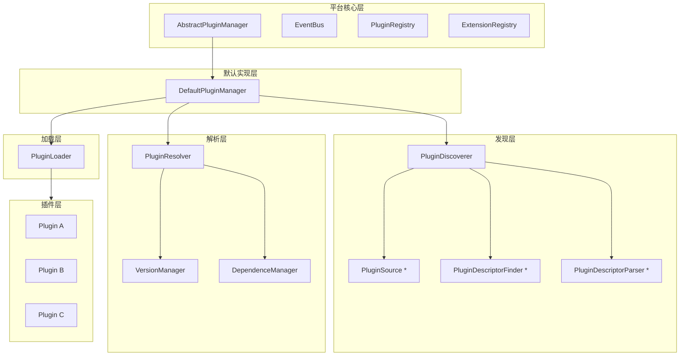
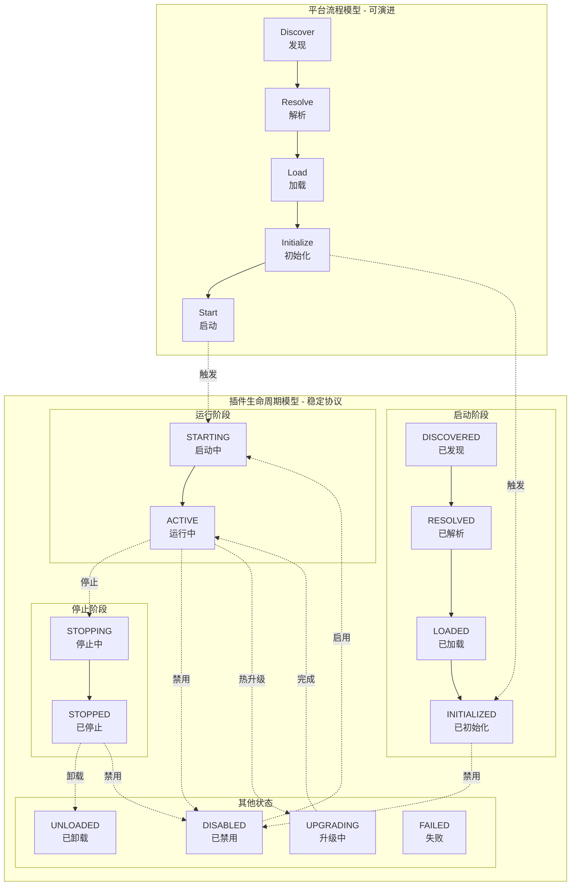
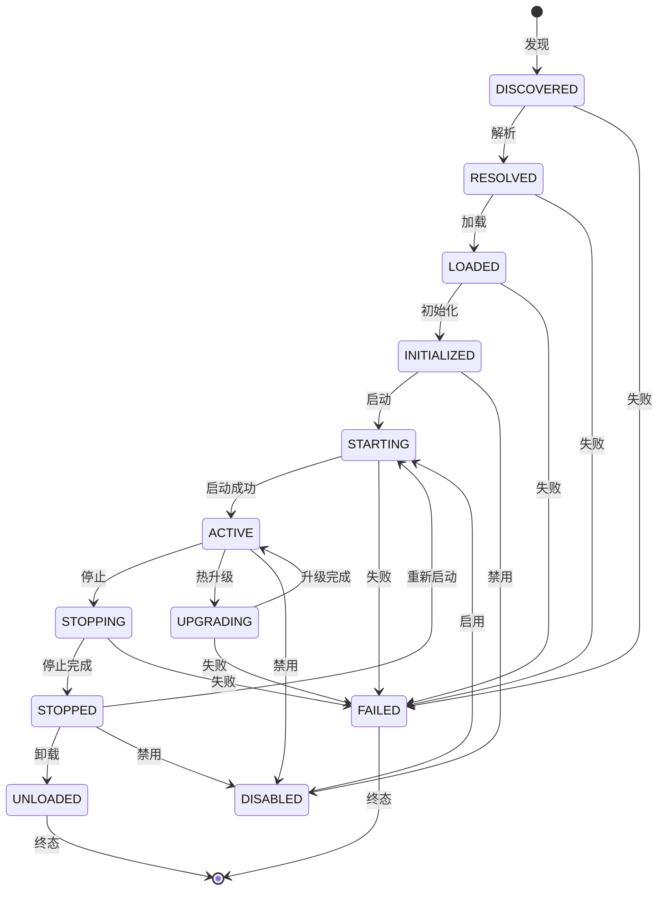
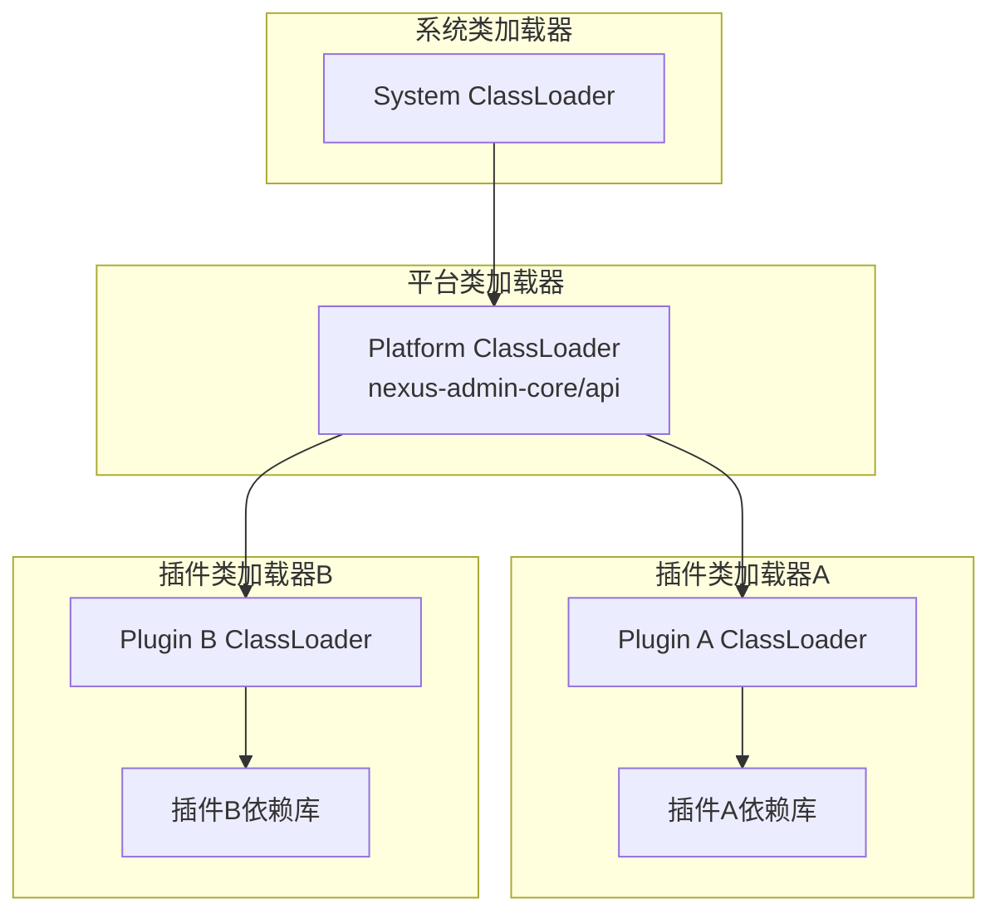
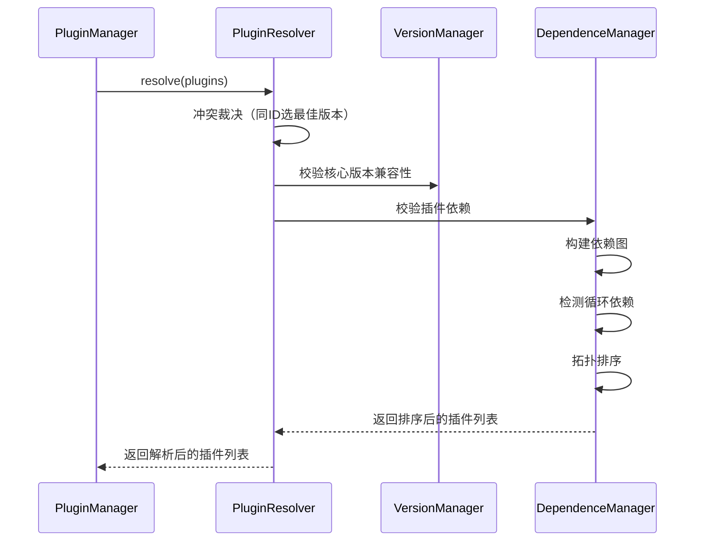

# 插件系统

------

## 1. 概述

### 1.1 设计目标

插件系统是 Nexus Admin 平台的核心基础设施，采用微内核架构实现能力的完全插件化。其设计目标包括：

- **极小内核**：核心保持稳定，所有可变能力外置为插件
- **强隔离性**：插件之间无直接耦合，通过扩展点交互
- **可替换性**：任何能力可被新插件替代，无需修改核心
- **生命周期管理**：完整的插件生命周期控制，支持动态加载/卸载
- **技术框架隔离**：技术框架不进入核心，插件可自主选择技术栈

### 1.2 核心原则

- **契约优先**：插件与平台通过接口契约交互，不依赖具体实现
- **类加载隔离**：每个插件拥有独立的 ClassLoader，避免类冲突
- **依赖显式声明**：插件依赖在描述文件中显式声明，支持自动解析
- **状态机驱动**：插件状态转换通过状态机管理，保证状态一致性
- **事件驱动通信**：插件间通过事件总线通信，避免直接依赖

------

## 2. 架构设计

### 2.1 整体架构



### 2.2 模块职责

| 模块 | 职责 | 说明 |
|------|------|------|
| PluginManager | 插件生命周期管理 | 协调发现、解析、加载、启动、停止、卸载全流程 |
| PluginRegistry | 插件注册中心 | 管理插件元数据、状态、依赖关系 |
| ExtensionRegistry | 扩展注册中心 | 管理插件提供的扩展实现 |
| ExtensionConsumer | 扩展点消费者模板 | 提供双重缓存与事件驱动失效机制，消费方应通过此模板获取扩展实现 |
| EventBus | 事件总线 | 插件生命周期事件发布与订阅 |
| PluginDiscoverer | 插件发现 | 从不同来源扫描候选插件 |
| PluginResolver | 插件解析 | 依赖校验、版本冲突解决、拓扑排序 |
| PluginLoader | 插件加载 | 构建 ClassLoader、实例化插件主类 |
| PluginSource | 插件源 | 抽象不同插件来源（本地目录、类路径、远程等） |
| PluginDescriptorFinder | 描述文件查找器 | 在不同环境中定位插件描述文件 |
| PluginDescriptorParser | 描述文件解析器 | 解析描述文件为 PluginDescriptor |

------

## 3. 核心组件层级关系

插件系统的核心组件按层级组织：

### 3.1 PluginDiscoverer（插件发现器）

**职责**：从多个来源发现候选插件，并处理为 PluginMetadata

**子组件**：
- PluginSource（可组合多实现）：从不同来源发现插件
- PluginDescriptorFinder（可组合多实现）：查找描述文件
- PluginDescriptorParser（可组合多实现）：解析描述文件

**处理流程**：
```
PluginSource 扫描 → PluginDescriptorFinder 定位 → 
PluginDescriptorParser 解析 → 构建 PluginMetadata
```

### 3.2 PluginResolver（插件解析器）

**职责**：处理候选插件的冲突、版本、依赖等，输出解析后的插件列表

**子组件**：
- VersionManager（只可装配一个实现）：版本比较与兼容性检查
- DependenceManager（只可装配一个实现）：依赖校验与拓扑排序

**处理流程**：
```
冲突裁决（同ID多版本）→ 版本校验 → 依赖校验 → 拓扑排序
```

### 3.3 PluginLoader（插件加载器）

**职责**：将已解析的插件加载为可运行状态

**特点**：
- 无子组件
- 创建 ClassLoader
- 实例化插件主类
- 构建 PluginWrapper

------

## 4. 双模型架构

插件系统采用严格分层的双模型结构：



### 4.1 平台流程模型

平台流程模型是工程实现模型，可演进、可扩展、可替换：

| 阶段 | 职责 | 说明 |
|------|------|------|
| Discover | 插件发现 | 扫描各类来源，生成候选插件元数据 |
| Resolve | 插件解析 | 依赖校验、版本冲突解决、拓扑排序 |
| Load | 插件加载 | 构建 ClassLoader，实例化插件主类 |
| Initialize | 插件初始化 | 调用插件 onInitialize 方法 |
| Start | 插件启动 | 调用插件 onStart 方法 |

### 4.2 插件生命周期模型

插件生命周期模型是对外稳定协议，长期保持不变：

| 阶段 | 状态 | 职责 | 说明 |
|------|------|------|------|
| 启动阶段 | DISCOVERED → RESOLVED → LOADED → INITIALIZED | 插件准备 | 发现、解析、加载、初始化 |
| 运行阶段 | STARTING → ACTIVE | 插件运行 | 启动、对外提供服务 |
| 停止阶段 | STOPPING → STOPPED | 插件停止 | 停止服务、释放资源 |
| 卸载阶段 | UNLOADED | 插件移除 | 清理、卸载 |
| 禁用相关 | DISABLED | 插件禁用 | 可参与解析但不可运行 |
| 升级阶段 | UPGRADING | 插件升级 | 热升级中双实例运行 |
| 异常阶段 | FAILED | 插件失败 | 任意阶段失败进入 |

------

## 5. 核心抽象

### 5.1 Plugin（插件接口）

插件必须实现的接口，定义插件生命周期回调。

```java
public interface Plugin {

    /**
     * 插件初始化阶段。
     * 状态迁移：LOADED → INITIALIZED
     */
    void onInitialize(PluginContext context) throws Exception;

    /**
     * 插件启动阶段。
     * 状态迁移：STARTING → ACTIVE
     */
    void onStart(PluginContext context) throws Exception;

    /**
     * 插件停止阶段。
     * 状态迁移：ACTIVE → STOPPING
     */
    void onStop(PluginContext context) throws Exception;

    /**
     * 插件卸载阶段。
     * 状态迁移：STOPPED → UNLOADED
     */
    void onUnload(PluginContext context) throws Exception;

    /**
     * 热升级钩子（可选）。
     * UPGRADING 阶段调用。
     */
    default void onUpgrade(PluginContext oldContext, PluginContext newContext) throws Exception {
        // 默认无操作
    }

    /**
     * 禁用通知（可选）。
     */
    default void onDisable(PluginContext context) throws Exception {
        // 默认无操作
    }

    /**
     * 启用通知（可选）。
     */
    default void onEnable(PluginContext context) throws Exception {
        // 默认无操作
    }
}
```

**生命周期回调说明**：

| 回调方法 | 状态迁移 | 触发时机 | 典型行为 |
|----------|----------|----------|----------|
| onInitialize | LOADED → INITIALIZED | 插件加载后 | 初始化配置、验证运行环境 |
| onStart | STARTING → ACTIVE | 插件启动时 | 注册扩展、启动线程、对外提供服务 |
| onStop | ACTIVE → STOPPING | 插件停止时 | 注销扩展、停止线程、释放资源 |
| onUnload | STOPPED → UNLOADED | 插件卸载前 | 清理外部状态、删除临时文件 |
| onUpgrade | UPGRADING | 热升级时 | 数据迁移、状态同步 |
| onDisable | → DISABLED | 插件禁用时 | 清理运行态资源 |
| onEnable | DISABLED → | 插件启用时 | 准备重新运行 |

**PluginContext 说明**：

所有生命周期方法都接收 PluginContext 参数，插件通过上下文与平台交互。详见 [插件上下文](插件上下文.md)。

------

### 5.2 AbstractPlugin（抽象基类）

为简化插件开发，平台提供 `AbstractPlugin` 抽象基类：

```java
public abstract class AbstractPlugin implements Plugin {

    // 生命周期模板方法（final，不可覆写）
    public final void onInitialize(PluginContext context) {
        this.context = context;
        initialize();
    }
    public final void onStart(PluginContext context) {
        this.context = context;
        start();
    }
    public final void onStop(PluginContext context) {
        this.context = context;
        stop();
    }
    public final void onUnload(PluginContext context) {
        this.context = context;
        unload();
    }

    // 子类可覆写的模板方法
    protected void initialize() throws Exception {}
    protected void start() throws Exception {}
    protected void stop() throws Exception {}
    protected void unload() throws Exception {}

    // 上下文快捷访问
    protected final PluginContext context() { ... }
    protected final String pluginId() { ... }
    protected final PluginWorkspace workspace() { ... }
    protected final ExtensionRegistry extensions() { ... }
    protected final EventPublisher events() { ... }
    protected final ConfigManager config() { ... }
}
```

**使用示例**：

```java
public class MyPlugin extends AbstractPlugin {

    @Override
    protected void initialize() throws Exception {
        System.out.println("插件初始化: " + pluginId());
    }

    @Override
    protected void start() throws Exception {
        extensions().register(MyExtension.class, new MyExtensionImpl());
    }
}
```

------

### 5.3 PluginManager（插件管理器）

插件系统的核心调度器，负责协调插件全生命周期。

```java
public interface PluginManager {

    void bootstrap();

    // 启动阶段（有序）
    List<PluginMetadata> discover();
    List<PluginMetadata> resolve(List<PluginMetadata> discoveredPlugins);
    List<PluginWrapper> load(List<PluginMetadata> resolvedPlugins);

    // 生命周期驱动
    void initialize(String pluginId);
    void start(String pluginId);
    void stop(String pluginId);
    void unload(String pluginId);
    void delete(String pluginId);

    // 启用/禁用
    void enable(String pluginId);
    void disable(String pluginId);
    boolean isEnabled(String pluginId);

    // 升级
    void upgradeCold(String pluginId, PluginMetadata newVersion);
    void upgradeHot(String pluginId, PluginMetadata newVersion);

    // 查询
    PluginState getState(String pluginId);
    PluginWrapper get(String pluginId);
    Collection<PluginWrapper> list();
    Collection<PluginWrapper> listByState(PluginState state);
    boolean isActive(String pluginId);

    // 批量操作
    void startAll(Collection<PluginWrapper> plugins);
    void stopAll(Collection<PluginWrapper> plugins);
    void reloadFailed(Collection<PluginWrapper> plugins);
}
```

------

### 5.4 PluginState（插件状态）

```java
public enum PluginState {
    // 启动阶段
    DISCOVERED,     // 已发现（仅元数据）
    RESOLVED,       // 冲突、依赖解析完成
    LOADED,         // 类加载完成
    INITIALIZED,    // 已初始化

    // 运行阶段
    STARTING,       // 启动中
    ACTIVE,         // 运行中

    // 停止阶段
    STOPPING,       // 停止中
    STOPPED,        // 已停止

    // 卸载阶段
    UNLOADED,       // 已卸载

    // 禁用相关
    DISABLED,       // 被禁用（可参与解析但不可运行）

    // 升级阶段
    UPGRADING,      // 升级中

    // 异常阶段
    FAILED          // 任意阶段失败
}
```

**状态转换规则**：



------

### 5.5 PluginDescriptor（插件描述符）

插件元数据定义，来源于 `META-INF/plugin.json` 描述文件。

```java
public final class PluginDescriptor {
    private final String id;                    // 插件唯一标识
    private final String version;               // 插件版本
    private final String name;                  // 插件名称
    private final String description;           // 插件描述
    private final String author;                // 插件作者
    private final String mainClass;             // 插件入口类
    private final String coreVersion;           // 支持的核心版本
    private final Map<String, String> dependencies;  // 依赖的其他插件
    private final Map<String, Object> requires;      // 运行环境要求
    private final Map<String, Object> metadata;      // 其他扩展元数据
}
```

**字段说明**：

| 字段 | 必填 | 说明 |
|------|------|------|
| id | 是 | 插件唯一标识，符合反向域名命名法 |
| version | 是 | 插件版本，建议使用语义化版本 |
| name | 否 | 插件显示名称 |
| description | 否 | 插件功能描述 |
| author | 否 | 插件作者 |
| mainClass | 否 | 插件入口类全限定名 |
| coreVersion | 否 | 支持的平台核心版本范围 |
| dependencies | 否 | 依赖的其他插件 |
| requires | 否 | 运行环境要求 |

------

### 5.6 PluginMetadata（插件元数据）

发现阶段产生的候选插件信息，尚未执行加载。

```java
public record PluginMetadata(
    String pluginId,           // 插件唯一标识
    PluginDescriptor descriptor,  // 插件描述信息
    PluginSource source,       // 插件来源
    SourceType sourceType      // 来源类型
) {
    public String getMainClass() {
        return descriptor.mainClass();
    }
}
```

------

### 5.7 PluginWrapper（插件包装器）

已加载插件的包装对象，包含运行时所需的所有信息。

```java
public final class PluginWrapper {
    private final PluginDescriptor descriptor;   // 插件描述信息
    private final Plugin plugin;                 // 插件实例
    private final ClassLoader classLoader;       // 插件专属类加载器
    private final PluginSource source;           // 插件来源
    private PluginState state;                   // 当前生命周期状态
}
```

**职责说明**：

PluginWrapper 仅维护插件的基本运行时信息（描述符、实例、类加载器、来源、状态），不负责创建 PluginContext。上下文由 PluginManager 统一创建和管理。详见 [插件上下文](插件上下文.md)。

------

## 6. 类加载机制

### 6.1 类加载架构



### 6.2 双亲委派模型

插件 ClassLoader 采用改进的双亲委派模型：

1. **首先委托平台 ClassLoader**：加载平台核心类和 API 类
2. **然后尝试自行加载**：加载插件自身的类和依赖
3. **最后委托系统 ClassLoader**：加载 JDK 标准类

**设计优势**：

- 插件间类隔离，避免依赖冲突
- 插件可共享平台 API
- 插件可携带独立版本的依赖库

------

## 7. 依赖管理

### 7.1 依赖声明

插件在 `plugin.json` 中声明依赖：

```json
{
  "id": "user-management",
  "version": "1.0.0",
  "dependencies": {
    "core-auth": "^1.0.0",
    "core-permission": "~1.0.0"
  }
}
```

### 7.2 依赖解析流程



### 7.3 版本范围语法

支持语义化版本范围：

| 符号 | 含义 | 示例 |
|------|------|------|
| ^ | 兼容次要版本 | ^1.2.3 → >=1.2.3 <2.0.0 |
| ~ | 兼容补丁版本 | ~1.2.3 → >=1.2.3 <1.3.0 |
| > | 大于 | >1.0.0 |
| >= | 大于等于 | >=1.0.0 |
| < | 小于 | <2.0.0 |
| <= | 小于等于 | <=2.0.0 |

------

## 8. 设计约束与实践规范

### 8.1 插件设计规范

- 插件主类应继承 `AbstractPlugin` 抽象基类（或实现 `Plugin` 接口）
- 插件ID全局唯一，建议使用反向域名命名法
- 插件版本遵循语义化版本规范
- 插件依赖必须显式声明，禁止隐式依赖

### 8.2 类加载规范

- 插件应优先使用平台提供的 API，避免直接依赖其他插件
- 插件依赖的第三方库应与平台隔离
- 禁止在插件中直接操作其他插件的 ClassLoader

### 8.3 生命周期规范

- `onInitialize` 阶段禁止启动业务线程，禁止对外提供服务
- `onStart` 应具备幂等语义
- `onStop` 是 `onStart` 的对称操作，应释放所有运行期资源
- `onUnload` 应清理所有外部副作用，禁止访问已释放资源
- `onUpgrade` 在双实例期间应保证兼容性
- 被禁用的插件可参与依赖解析和拓扑排序，但不可启动运行

### 8.4 扩展注册规范

- 扩展注册应在 `onStart` 中完成
- 扩展注销应在 `onStop` 中完成
- 禁止在 `onInitialize` 中注册扩展
- 禁止在 `onUnload` 中访问已注销的扩展
- 消费扩展实现应通过 `ExtensionConsumer` 模板获取，而非直接调用 `ExtensionRegistry`，以获得缓存优化和事件驱动失效能力

------

## 9. 总结

### 核心原则

1. **模型分层清晰**：平台流程与插件生命周期严格分离
2. **边界稳定**：插件生命周期作为长期稳定协议
3. **流程可演进**：平台内部实现可重构、可替换
4. **协议简单**：最小完备的生命周期集合

### 架构优势

- **可扩展性**：通过接口支持多种来源、格式、加载策略
- **可测试性**：各组件职责单一，便于单元测试
- **可维护性**：清晰的职责边界，降低代码耦合
- **可观测性**：事件机制支持全生命周期监控

一个成熟的插件系统，不是生命周期多，而是：**模型分层清晰、边界稳定、协议简单、流程可演进**。
