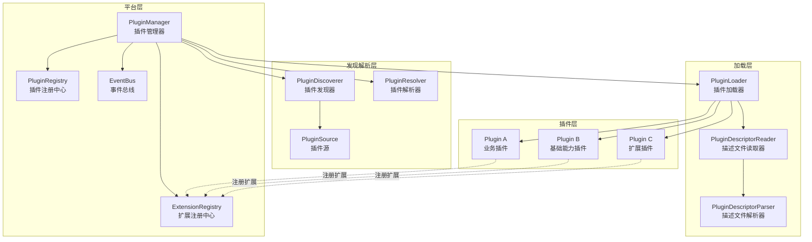
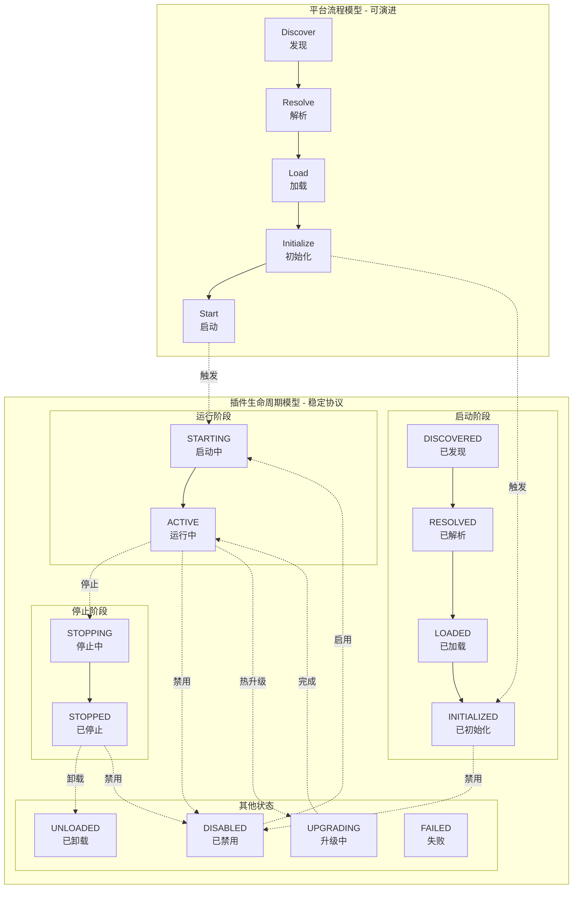
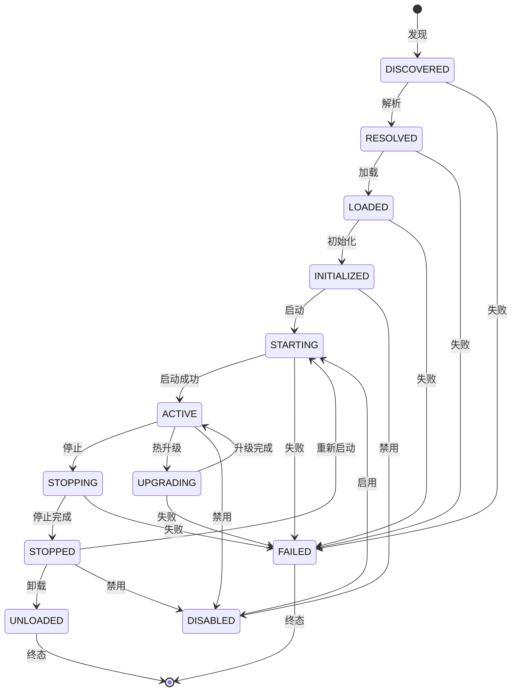
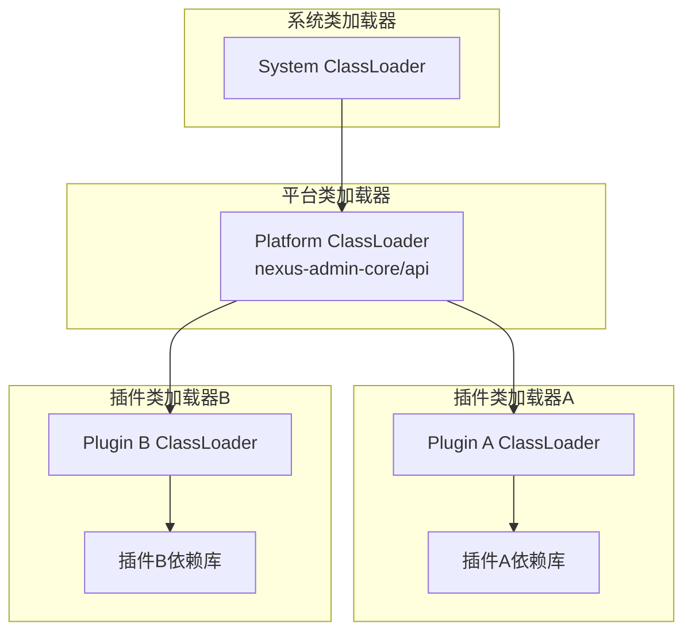
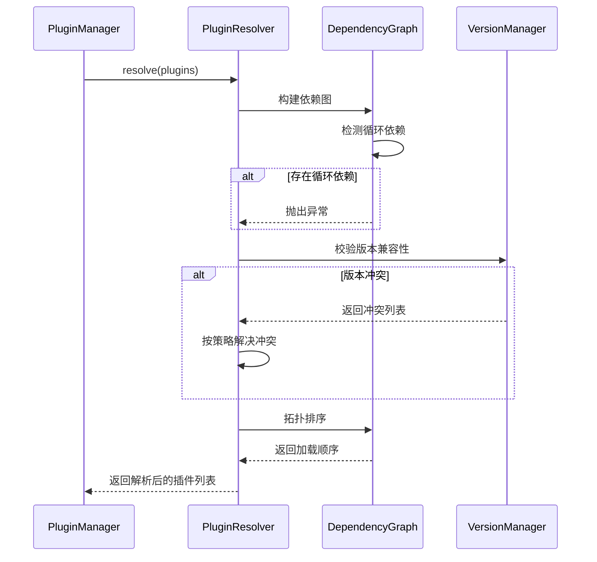
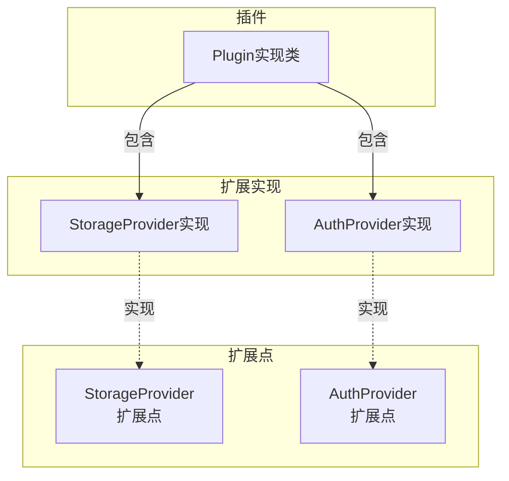
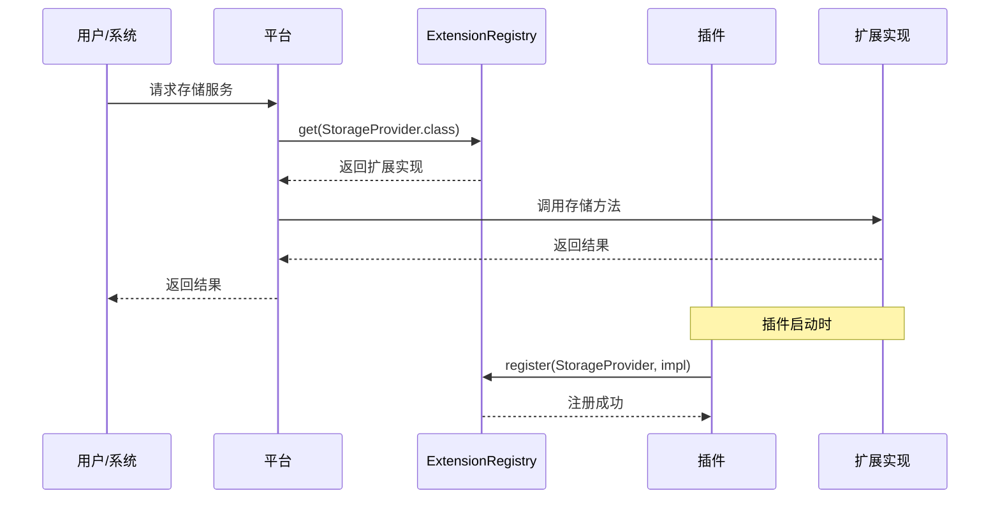

# 插件系统设计

------

## 1. 概述

### 1.1 设计目标

插件系统是 Nexus Admin 平台的核心基础设施，采用微内核架构实现能力的完全插件化。其设计目标包括：

- **极小内核**：核心保持稳定，所有可变能力外置为插件
- **强隔离性**：插件之间无直接耦合，通过扩展点交互
- **可替换性**：任何能力可被新插件替代，无需修改核心
- **生命周期管理**：完整的插件生命周期控制，支持动态加载/卸载
- **技术框架隔离**：技术框架不进入核心，插件可自主选择技术栈

### 1.2 核心原则

- **契约优先**：插件与平台通过接口契约交互，不依赖具体实现
- **类加载隔离**：每个插件拥有独立的 ClassLoader，避免类冲突
- **依赖显式声明**：插件依赖在描述文件中显式声明，支持自动解析
- **状态机驱动**：插件状态转换通过状态机管理，保证状态一致性
- **事件驱动通信**：插件间通过事件总线通信，避免直接依赖

------

## 2. 架构设计

### 2.1 整体架构



### 2.2 模块职责

| 模块 | 职责 | 说明 |
|------|------|------|
| PluginManager | 插件生命周期管理 | 协调发现、解析、加载、启动、停止、卸载全流程 |
| PluginRegistry | 插件注册中心 | 管理插件元数据、状态、依赖关系 |
| ExtensionRegistry | 扩展注册中心 | 管理插件提供的扩展实现 |
| EventBus | 事件总线 | 插件生命周期事件发布与订阅 |
| PluginDiscoverer | 插件发现 | 从不同来源扫描候选插件 |
| PluginResolver | 插件解析 | 依赖校验、版本冲突解决、拓扑排序 |
| PluginLoader | 插件加载 | 构建 ClassLoader、实例化插件主类 |
| PluginSource | 插件源 | 抽象不同插件来源（本地目录、类路径、远程等） |

------

## 3. 双模型架构

插件系统采用严格分层的双模型结构：



### 3.1 平台流程模型

平台流程模型是工程实现模型，可演进、可扩展、可替换：

| 阶段 | 职责 | 说明 |
|------|------|------|
| Discover | 插件发现 | 扫描各类来源，生成候选插件元数据 |
| Resolve | 插件解析 | 依赖校验、版本冲突解决、拓扑排序 |
| Load | 插件加载 | 构建 ClassLoader，实例化插件主类 |
| Initialize | 插件初始化 | 调用插件 onInitialize 方法 |
| Start | 插件启动 | 调用插件 onStart 方法 |

### 3.2 插件生命周期模型

插件生命周期模型是对外稳定协议，长期保持不变：

| 阶段 | 状态 | 职责 | 说明 |
|------|------|------|------|
| 启动阶段 | DISCOVERED → RESOLVED → LOADED → INITIALIZED | 插件准备 | 发现、解析、加载、初始化 |
| 运行阶段 | STARTING → ACTIVE | 插件运行 | 启动、对外提供服务 |
| 停止阶段 | STOPPING → STOPPED | 插件停止 | 停止服务、释放资源 |
| 卸载阶段 | UNLOADED | 插件移除 | 清理、卸载 |
| 禁用相关 | DISABLED | 插件禁用 | 可参与解析但不可运行 |
| 升级阶段 | UPGRADING | 插件升级 | 热升级中双实例运行 |
| 异常阶段 | FAILED | 插件失败 | 任意阶段失败进入 |

------

## 4. 核心抽象

### 4.1 Plugin（插件接口）

插件必须实现的接口，定义插件生命周期回调。

```java
public interface Plugin {

    /**
     * 插件初始化阶段。
     * 状态迁移：LOADED → INITIALIZED
     */
    void onInitialize(PluginContext context) throws Exception;

    /**
     * 插件启动阶段。
     * 状态迁移：STARTING → ACTIVE
     */
    void onStart() throws Exception;

    /**
     * 插件停止阶段。
     * 状态迁移：ACTIVE → STOPPING
     */
    void onStop() throws Exception;

    /**
     * 插件卸载阶段。
     * 状态迁移：STOPPED → UNLOADED
     */
    void onUnload() throws Exception;

    /**
     * 热升级钩子（可选）。
     * UPGRADING 阶段调用。
     */
    default void onUpgrade(PluginContext newContext) throws Exception {
        // 默认无操作
    }

    /**
     * 禁用通知（可选）。
     */
    default void onDisable() throws Exception {
        // 默认无操作
    }

    /**
     * 启用通知（可选）。
     */
    default void onEnable() throws Exception {
        // 默认无操作
    }
}
```

**生命周期回调说明**：

| 回调方法 | 状态迁移 | 触发时机 | 典型行为 |
|----------|----------|----------|----------|
| onInitialize | LOADED → INITIALIZED | 插件加载后 | 初始化配置、验证运行环境 |
| onStart | STARTING → ACTIVE | 插件启动时 | 注册扩展、启动线程、对外提供服务 |
| onStop | ACTIVE → STOPPING | 插件停止时 | 注销扩展、停止线程、释放资源 |
| onUnload | STOPPED → UNLOADED | 插件卸载前 | 清理外部状态、删除临时文件 |
| onUpgrade | UPGRADING | 热升级时 | 数据迁移、状态同步 |
| onDisable | → DISABLED | 插件禁用时 | 清理运行态资源 |
| onEnable | DISABLED → | 插件启用时 | 准备重新运行 |

------

### 4.2 PluginManager（插件管理器）

插件系统的核心调度器，负责协调插件全生命周期。

```java
public interface PluginManager {

    void bootstrap();

    List<PluginMetadata> discover();

    List<PluginMetadata> resolve(List<PluginMetadata> discoveredPlugins);

    List<PluginWrapper> load(List<PluginMetadata> resolvedPlugins);

    void initialize(String pluginId);

    void start(String pluginId);

    void stop(String pluginId);

    void unload(String pluginId);

    void delete(String pluginId);

    PluginState getState(String pluginId);

    PluginWrapper get(String pluginId);

    Collection<PluginWrapper> list();
}
```

------

### 4.3 PluginState（插件状态）

```java
public enum PluginState {
    // ===== 启动阶段 =====
    DISCOVERED,     // 已发现（仅元数据）
    RESOLVED,       // 冲突、依赖解析完成
    LOADED,         // 类加载完成
    INITIALIZED,    // 已初始化

    // ===== 运行阶段 =====
    STARTING,       // 启动中
    ACTIVE,         // 运行中

    // ===== 停止阶段 =====
    STOPPING,       // 停止中
    STOPPED,        // 已停止

    // ===== 卸载阶段 =====
    UNLOADED,       // 已卸载

    // ===== 禁用相关 =====
    DISABLED,       // 被禁用（可参与解析但不可运行）

    // ===== 升级阶段 =====
    UPGRADING,      // 升级中

    // ===== 异常阶段 =====
    FAILED          // 任意阶段失败
}
```

**状态转换规则**：



------

### 4.4 PluginDescriptor（插件描述符）

插件元数据定义，来源于 `META-INF/plugin.json` 描述文件。

```java
public class PluginDescriptor {

    private String id;
    private String version;
    private String name;
    private String description;
    private String author;
    private String mainClass;
    private String coreVersion;
    private Map<String, String> dependencies;
    private Map<String, Object> requires;
    private Map<String, Object> metadata;
}
```

**字段说明**：

| 字段 | 必填 | 说明 |
|------|------|------|
| id | 是 | 插件唯一标识，符合反向域名命名法 |
| version | 是 | 插件版本，建议使用语义化版本 |
| name | 否 | 插件显示名称 |
| description | 否 | 插件功能描述 |
| author | 否 | 插件作者 |
| mainClass | 否 | 插件入口类全限定名 |
| coreVersion | 否 | 支持的平台核心版本范围 |
| dependencies | 否 | 依赖的其他插件 |
| requires | 否 | 运行环境要求 |

------

## 5. 类加载机制

### 5.1 类加载架构



### 5.2 双亲委派模型

插件 ClassLoader 采用改进的双亲委派模型：

1. **首先委托平台 ClassLoader**：加载平台核心类和 API 类
2. **然后尝试自行加载**：加载插件自身的类和依赖
3. **最后委托系统 ClassLoader**：加载 JDK 标准类

**设计优势**：

- 插件间类隔离，避免依赖冲突
- 插件可共享平台 API
- 插件可携带独立版本的依赖库

------

## 6. 依赖管理

### 6.1 依赖声明

插件在 `plugin.json` 中声明依赖：

```json
{
  "id": "user-management",
  "version": "1.0.0",
  "dependencies": {
    "core-auth": "^1.0.0",
    "core-permission": "~1.0.0"
  }
}
```

### 6.2 依赖解析流程



### 6.3 版本范围语法

支持 npm 风格的版本范围：

| 符号 | 含义 | 示例 |
|------|------|------|
| ^ | 兼容次要版本 | ^1.2.3 → >=1.2.3 <2.0.0 |
| ~ | 兼容补丁版本 | ~1.2.3 → >=1.2.3 <1.3.0 |
| > | 大于 | >1.0.0 |
| >= | 大于等于 | >=1.0.0 |
| < | 小于 | <2.0.0 |
| <= | 小于等于 | <=2.0.0 |

------

## 7. 事件机制

### 7.1 生命周期事件

平台通过事件机制将生命周期各阶段暴露给监听者：

| 阶段 | 事件 |
|------|------|
| Discover | DISCOVER_START, DISCOVER_END, DISCOVERED |
| Resolve | RESOLVE_START, RESOLVE_END, RESOLVED |
| Load | LOAD_START, LOAD_END, LOADED, LOAD_FAILED |
| Initialize | INITIALIZE_START, INITIALIZE_END, INITIALIZED |
| Start | STARTING, STARTED, START_FAILED |
| Stop | STOPPING, STOPPED |
| Unload | UNLOADING, UNLOADED |
| Disable | DISABLING, DISABLED |
| Enable | ENABLING, ENABLED |
| Upgrade | UPGRADING, UPGRADED |

### 7.2 事件监听

```java
public interface PluginLifecycleListener {

    void onEvent(PluginEvent event);

    boolean supports(PluginEvent event);
}
```

**事件用途**：

- 日志记录：记录各阶段日志
- 监控告警：监听失败事件触发告警
- 审计追踪：记录插件全生命周期轨迹
- 扩展处理：在特定阶段执行自定义逻辑

------

## 8. 插件与扩展点的关系

### 8.1 关系模型



### 8.2 协作流程



**设计要点**：

- 插件是扩展实现的容器，一个插件可提供多个扩展实现
- 扩展点是平台定义的契约，插件通过实现扩展点来提供服务
- 扩展注册中心是插件与平台交互的桥梁
- 插件生命周期与扩展生命周期绑定

------

## 9. 设计约束与实践规范

### 9.1 插件设计规范

- 插件主类必须实现 `Plugin` 接口
- 插件ID全局唯一，建议使用反向域名命名法
- 插件版本遵循语义化版本规范
- 插件依赖必须显式声明，禁止隐式依赖

### 9.2 类加载规范

- 插件应优先使用平台提供的 API，避免直接依赖其他插件
- 插件依赖的第三方库应与平台隔离
- 禁止在插件中直接操作其他插件的 ClassLoader

### 9.3 生命周期规范

- `onInitialize` 阶段禁止启动业务线程，禁止对外提供服务
- `onStart` 应具备幂等语义
- `onStop` 是 `onStart` 的对称操作，应释放所有运行期资源
- `onUnload` 应清理所有外部副作用，禁止访问已释放资源
- `onUpgrade` 在双实例期间应保证兼容性
- 被禁用的插件可参与依赖解析和拓扑排序，但不可启动运行

### 9.4 扩展注册规范

- 扩展注册应在 `onStart` 中完成
- 扩展注销应在 `onStop` 中完成
- 禁止在 `onInitialize` 中注册扩展
- 禁止在 `onUnload` 中访问已注销的扩展

------

## 10. 总结

### 核心原则

1. **模型分层清晰**：平台流程与插件生命周期严格分离
2. **边界稳定**：插件生命周期作为长期稳定协议
3. **流程可演进**：平台内部实现可重构、可替换
4. **协议简单**：最小完备的生命周期集合

### 架构优势

- **可扩展性**：通过接口支持多种来源、格式、加载策略
- **可测试性**：各组件职责单一，便于单元测试
- **可维护性**：清晰的职责边界，降低代码耦合
- **可观测性**：事件机制支持全生命周期监控

一个成熟的插件系统，不是生命周期多，而是：**模型分层清晰、边界稳定、协议简单、流程可演进**。
