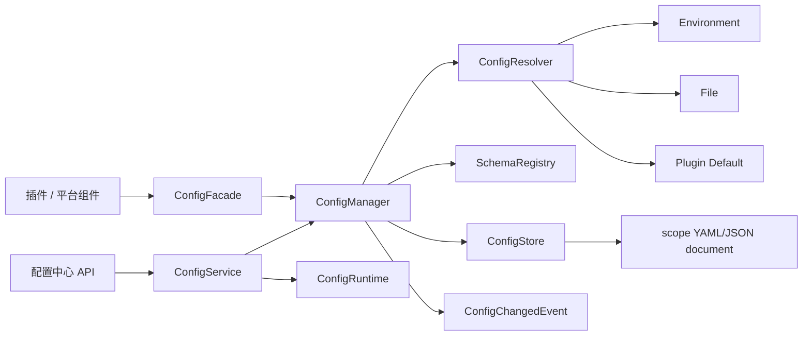
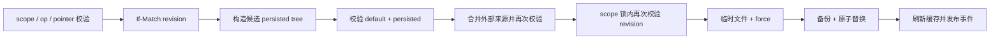

# 配置中心

## 1. 定位

配置中心为平台运行期策略和插件私有配置提供统一的读取、持久化、Schema、来源解释、热更新与管理 API。Spring 启动参数、端口、插件数据目录等启动期静态配置仍由 `application.yml`、环境变量或启动参数管理，不因本模块存在而变为可热修改配置。

核心约束：

- `ConfigManager` 是核心代码和插件访问配置的唯一入口。
- 配置域 ID 是 URL-safe opaque ID；插件域 ID 就是原始 `pluginId`。
- 明确保留的平台域为 `platform` 和 `platform.disabled`，不能用字符串前缀推断域类型。
- 配置值保持 YAML/JSON 原生类型；面向旧插件的 `get(scope,key)` 仍提供字符串视图。
- Schema 使用 JSON Schema Draft 2020-12 并保留原始文档。
- scope 级写入必须校验、乐观锁和原子提交；失败不产生部分结果。
- 敏感值不回显，不进入日志和配置变更事件。

## 2. 总体架构



### 2.1 ConfigRuntime

`ConfigRuntime` 统一装配 store、resolver、Schema registry/provider/validator、manager 和 facade。默认运行时：

| 组件 | 默认实现 |
|---|---|
| 配置存储 | `FileConfigStore` |
| 配置解析器 | `ConfigResolver` |
| 配置源 | `EnvConfigSource` → `FileConfigSource` → `DefaultConfigSource` |
| 插件 Schema | `JsonPluginSchemaProvider` |
| 平台 Schema | `PlatformSchemaProvider` |
| Schema 校验 | `JsonSchemaValidator`，Draft 2020-12 |

运行时构建时立即注册 `platform` 和 `platform.disabled` Schema。插件加载后调用 `registerPlugin(pluginId,classLoader)`，同一个原始 `pluginId` 同时用于 Schema registry、默认配置和持久化文件映射。

Spring 只允许以完整 `ConfigRuntime` 为配置中心替换边界；`ConfigManager`、`ConfigFacade`、`ConfigStore` 和 `SchemaRegistry` 必须来自同一个 runtime，禁止逐个覆盖造成读写 split-brain。

### 2.2 ConfigManager 与 ConfigFacade

`ConfigManager` 提供单值读写、类型转换、Schema 注册、原子 scope 替换、document 替换、revision 和监听器能力。`ConfigFacade` 是稳定门面，不重新实现业务逻辑。

管理 API 的结构化写入与 document 写入最终都通过 manager 完成。manager 只在 store 成功提交后刷新 resolver 并发布事件。同一 scope 的“写入 → 缓存失效 → 事件发布”由 manager 串行化，事件顺序与提交顺序一致。

### 2.3 ConfigStore

`ConfigStore` 提供普通读写能力，并为支持事务的实现定义：

- `getRevision(scope)`
- `replaceScope(scope,values,expectedRevision)`
- `readDocument(scope)` / `parseDocument(format,content)`
- `replaceDocument(scope,format,content,expectedRevision)`
- `listScopes()` / `supportsDocuments()`

其他存储实现可以不支持原始文档；此时 domain capability 必须返回 false，管理 API 不伪造能力。

domain `capabilities` 和插件 `configuration.canView/canEdit` 是当前认证用户在当前请求中的有效能力，不是仅描述后端是否实现该功能。接口拦截与能力计算统一使用 `PermissionResolver`；无认证上下文或无 resolver 时关闭能力。存储、Schema、敏感域策略和用户权限任一不满足，对应能力都必须为 false。

## 3. 配置域与文件映射

scope 使用统一的小写规范：`[a-z][a-z0-9_-]*(?:\.[a-z0-9_-]+)*`，最长 128 个字符。拒绝大写、连续点、首尾点和路径分隔符。`platform`、`platform.disabled` 为保留 ID，插件描述符和注册入口都不能使用。路径由服务端映射，客户端从不提交服务器路径。

| scope | 文件 |
|---|---|
| `platform` | `platform.yml` |
| `platform.disabled` | `platform.disabled.yml` |
| 原始插件 ID，例如 `demo-plugin` | `demo-plugin.yml` |

目标路径执行 absolute/normalize 后必须仍位于配置根目录。插件 ID `platformer` 是普通插件域；只有显式保留 ID 才是平台域。

## 4. 值、来源与 snapshot

解析优先级从高到低：

```text
Environment → File → Default
```

`Default` 合并两类默认值：Schema `default` 和插件 `META-INF/config.yml`，后者覆盖同路径的 Schema default。默认层同时进入运行时 resolver 和管理 API，不允许出现“界面显示默认值但插件读取不到”的分叉。环境变量及自定义高优先级 `ConfigSource` 在 API snapshot 中依据 Schema 类型转换为 boolean、integer、number、array 或 object；无法安全转换时保留字符串并由 Schema 校验暴露问题。

管理 API 返回：

- `effectiveValues`：按优先级解析后的当前有效值。
- `persistedValues`：文件层 override。
- `defaultValues`：Schema 和插件默认层。
- `fieldStates`：每个 JSON Pointer 的来源、三层存在状态、ENV 覆盖、只读、敏感和重启提示。
- `revision`：当前配置文档内容的 SHA-256 摘要前缀。

敏感路径由 `writeOnly: true` 或 `x-ui-options.sensitive: true` 标识。识别遍历保留 `$ref` sibling annotation，并循环安全地覆盖 `allOf/anyOf/oneOf`、条件分支和本地引用；父对象含敏感后代时，普通父级 `set/unset` 也会被拒绝。若 array 的 `items/prefixItems` 含敏感字段，整个 array 作为原子敏感值管理，避免索引变化或列表遍历造成泄漏。三个 values 对象完全省略敏感路径及其敏感祖先，`fieldStates` 只保留 `has*Value`，不返回掩码、长度或哈希。

## 5. Schema

插件 Schema 路径为 `META-INF/schema.json`，平台 Schema 位于 core 模块 `META-INF/schema/platform*.json`。统一方言：

```json
{
  "$schema": "https://json-schema.org/draft/2020-12/schema",
  "type": "object",
  "properties": {}
}
```

`ConfigSchema` 同时保存：

1. 原始 `JsonNode document`，供校验和管理 API 无损返回。
2. 顶层 `ConfigProperty` 摘要，供现有核心绑定器使用。

不得从 `ConfigProperty` 或 `ConfigUIBuilder.fields[]` 反向重建管理 API Schema。嵌套 object/array、条件、`$defs`、本地 `$ref`、`x-ui-group`、`x-ui-groups` 和 `x-ui-options` 必须保留。远程 `$ref` 和超过 64 层的 Schema 被 provider 拒绝。

常用 UI 扩展：

```json
{
  "type": "string",
  "writeOnly": true,
  "x-ui-group": "security",
  "x-ui-options": {
    "widget": "password",
    "order": 30,
    "span": 12,
    "advanced": false,
    "unit": null,
    "sensitive": true,
    "restartRequired": false
  }
}
```

扩展只描述数据和展示提示，不能指定可执行脚本、远程组件或 HTML。

## 6. 结构化事务

API 使用 JSON Pointer change，而不是完整字符串 Map：

| op | 语义 |
|---|---|
| `set` | 设置普通 persisted value |
| `unset` | 移除普通字段 override，回退到更低配置层；敏感字段拒绝此操作 |
| `replace-sensitive` | 替换敏感值，不回显旧值或新值 |
| `clear-sensitive` | 移除敏感 override |

敏感字段只接受 `replace-sensitive` 或 `clear-sensitive`，两者除 `config.manage` 外还要求 `config.secret.rotate`。无该权限时 `fieldStates.persistedWritable=false` 并返回稳定只读原因。重置 API 在服务端将敏感路径转换为受控的 `clear-sensitive`，普通字段转换为 `unset`，因此不会形成通过通用操作或父对象写入绕过敏感字段语义的路径。

提交顺序：



`FileConfigStore` 使用每个 scope 独立 `ReentrantLock`。revision 校验和文件替换处于同一临界区，避免 TOCTOU；manager 另以同一 scope 为边界把提交、缓存失效和事件发布串行化。服务端分别校验 `default + persisted` 和最终 effective，外部来源不能掩盖准备落盘的非法值。临时文件与目标文件位于同一目录；文件系统不支持 `ATOMIC_MOVE` 时写入失败，不降级成非原子覆盖。旧文件保留为单份 `.bak` 故障恢复副本。

## 7. 原始文档

默认存储支持 YAML 和 JSON，根节点必须是对象，UTF-8 内容最大 524288 字节。YAML 使用 SnakeYAML `SafeConstructor`，禁用重复键并限制 alias 数和 code point 数。

document save 在解析与 Schema 校验后原样写入请求文本：

- YAML 注释和字段顺序不会因 document 模式保存而被序列化器改写。
- JSON 是 YAML 的合法子集，可原样存入 scope 文件；document format 根据内容检测。
- structured save 是数据树事务，会生成规范化 YAML，不承诺保留原文注释。

原始文档权限独立为 `config.document.view/manage`。当前认证体系没有“近期重新认证”能力，因此包含任一敏感字段的域：

- document read 返回空 content、`redacted=true`、`writable=false`。
- document validate/save 返回 HTTP 423。
- domain `editDocument=false`。

这是默认关闭的真实 capability，不提供绕过接口。未来接入近期重新认证和持久化审计后，才能评审是否开放完整敏感文档。

## 8. 事件与日志

提交成功后按 changed path 发布 `ConfigChangedEvent`。敏感事件的 `value/oldValue` 始终为 null，并带 `sensitive=true`；`toString()` 不输出值。resolver、store、manager 和 API 日志只记录 scope、路径、revision、变更数量和经过换行净化的 reason。

当前日志系统不是可靠的版本历史或持久化审计存储，管理界面不得宣称支持历史回滚。`.bak` 仅用于故障恢复，不是面向用户的版本功能。

## 9. 安全与失败语义

- 无 Schema 的域可以读取持久化 snapshot 和文档，但不能结构化编辑。
- Schema 校验是服务端最终裁决，客户端校验仅改善体验。
- validation issue 的 message 由 Schema keyword 生成，params 仅携带安全约束；不透传验证库原始消息或 rejected value，避免敏感草稿进入 validate 成功响应和错误响应。
- 错误使用 `application/problem+json`；`errorCode` 为稳定字符串，始终含 `traceId`，配置错误可附带 `scopeId/currentRevision`。字段错误仅含 `path/keyword/messageKey/params/line/column`。
- revision 冲突返回 HTTP 409 和当前 revision；本地草稿由客户端保留。
- 文档过大返回 413，语义校验失败返回 422，敏感文档锁定返回 423。
- 任何提交失败都不得刷新缓存、发布成功事件或改变旧文件。

完整 HTTP 契约见 [管理面板 API 规范](../../api/管理面板API规范.md#53-配置中心-api)。

## 10. 测试边界

配置中心自动化测试至少覆盖：

- scope 路径穿越、原始插件 ID 与平台保留域区分。
- JSON/YAML 类型保持、document 格式识别和备份。
- stale revision 拒绝且旧值不变。
- Draft 2020-12 嵌套结构与 `x-ui-*` 无损保留、远程 `$ref` 拒绝。
- 组合 Schema、`$ref` sibling 和递归本地引用的敏感识别与循环终止。
- 平台 Schema 启动即注册且敏感默认值不存在。
- 有效/无效结构化更新、类型保持和全事务失败。
- snapshot 敏感省略、原始文档锁定和大小限制。
- 含敏感 item 的数组按原子敏感值脱敏、替换与清除。
- 敏感字段拒绝普通 `set/unset`，仅接受专用替换/清除操作，且 reset 仍可受控清除。
- 外部来源不能掩盖非法 persisted 值，自定义来源与运行时 resolver 结果一致。
- 并发 scope 写入的事件顺序与提交顺序一致。
- domain 与插件能力元数据反映当前用户的有效权限。
