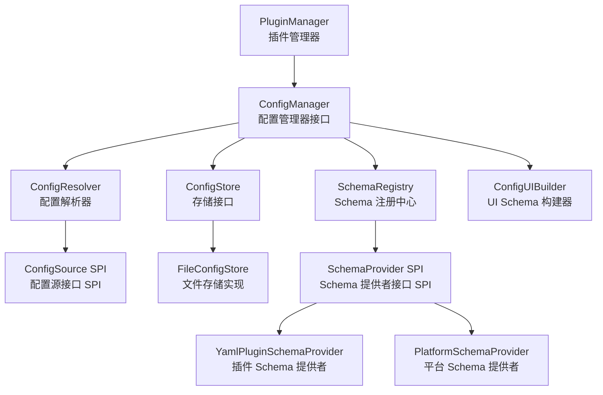

# 配置中心

------

## 1. 概述

### 1.1 设计目标

配置中心是 Nexus Admin 平台的核心基础设施，为平台和插件提供统一的配置管理能力。其设计目标包括：

- **统一入口**：通过 ConfigManager 提供配置读写的统一入口
- **多源支持**：支持环境变量、文件、默认配置等多种配置来源
- **热更新**：配置变更通过事件机制通知相关组件
- **Schema 驱动**：支持通过 schema.yml 定义配置结构，自动生成 UI Schema

### 1.2 核心原则

- **SPI 扩展**：存储和配置源均通过 SPI 抽象，支持未来扩展
- **可选 Schema**：插件可选择是否提供 schema.yml 和 config.yml
- **低耦合**：PluginManager 仅依赖 ConfigManager 接口，不依赖具体实现
- **文件持久化**：默认使用文件存储，无需外部依赖

------

## 2. 架构设计



**依赖约束**：

- PluginManager 仅依赖 ConfigManager 接口
- ConfigManager 整合所有子组件，对外提供统一入口
- 存储和配置源通过 SPI 抽象，支持未来扩展

------

## 3. 核心组件

### 3.1 ConfigManager

配置中心的统一入口，提供配置读写、Schema 管理、UI Schema 生成等能力。

| 方法 | 说明 |
|------|------|
| get(scope, key) | 获取配置值 |
| set(scope, key, value) | 设置配置值 |
| getSchema(schemaId) | 获取指定配置域 Schema |
| buildUISchema(schemaId) | 构建指定配置域 UI Schema |
| getPlatformSchema() | 获取平台 Schema（便捷方法） |
| buildPlatformUISchema() | 构建平台 UI Schema（便捷方法） |
| registerPlugin(pluginId, classLoader) | 注册插件配置 |
| isPluginDisabled(pluginId) | 检查插件禁用状态 |

**Scope 规范**：

| Scope | 说明 |
|-------|------|
| platform | 平台级配置 |
| platform.disabled | 插件禁用配置 |
| {pluginId} | 插件私有配置 |

### 3.2 ConfigResolver

按优先级解析配置，优先级从高到低：

```
Env（环境变量）→ File（文件配置）→ Default（插件默认配置）
```

**优先级数值规则**：ConfigSource.priority() 返回值越小，优先级越高。默认实现中 EnvConfigSource 为 10，FileConfigSource 为 20，DefaultConfigSource 为 30。

### 3.3 ConfigStore SPI

配置存储接口，支持多种实现：

| 实现 | 说明 |
|------|------|
| FileConfigStore | 文件存储（默认） |
| DatabaseConfigStore | 数据库存储（未来） |
| RemoteConfigStore | 远程配置中心（未来） |

### 3.4 SchemaProvider SPI

Schema 提供者接口，支持从不同来源加载配置 Schema：

| 实现 | 说明 |
|------|------|
| YamlPluginSchemaProvider | 从插件 META-INF/schema.yml 加载 |
| PlatformSchemaProvider | 从平台 META-INF/platform/*.yml 加载并合并 |

**Schema 合并规则**：

- 平台 Schema 由多个子作用域 Schema 合并而成
- 子作用域如 `platform.disabled` 的属性键会添加前缀（如 `disabled.disabled-plugins`）
- 最终对外统一为 `schemaId = "platform"` 的单一 Schema

### 3.5 PluginConfigBinder

将配置自动绑定到对象字段，支持配置热更新时重新绑定。

------

## 4. 配置文件

### 4.1 插件配置文件

插件可选择性提供以下配置文件：

| 文件 | 位置 | 说明 |
|------|------|------|
| schema.yml | META-INF/schema.yml | 配置 Schema 定义（可选） |
| config.yml | META-INF/config.yml | 默认配置值（可选） |

### 4.2 平台配置文件

平台配置 Schema 定义文件：

| 文件 | 位置 | 说明 |
|------|------|------|
| platform.yml | META-INF/schema/platform.yml | 平台基础配置 Schema |
| platform-disabled.yml | META-INF/schema/platform-disabled.yml | 平台禁用配置 Schema |

平台 Schema 由多个子作用域 Schema 合并而成，对外统一为 `schemaId = "platform"`。

### 4.3 Schema 示例

**插件 Schema 示例**：

```yaml
pluginId: order-plugin
properties:
  timeout:
    type: integer
    title: 订单超时时间
    description: 订单创建后自动关闭时间
    default: 30
    minimum: 1
    maximum: 3600
  enableAutoRetry:
    type: boolean
    title: 自动重试
    default: true
```

**平台 Schema 示例**：

```yaml
# META-INF/schema/platform.yml
pluginId: platform
properties:
  coreVersion:
    type: string
    title: 核心版本
    default: "1.0.0"
  maxConcurrentPlugins:
    type: integer
    title: 最大并发插件数
    default: 50
    minimum: 1
    maximum: 500
```

### 4.4 默认配置示例

```yaml
timeout: 30
enableAutoRetry: true
```

------

## 5. 配置热更新

配置变更流程：

```
ConfigManager.set()
      │
      ▼
ConfigStore.write()
      │
      ▼
ConfigResolver.invalidateCache()
      │
      ▼
EventBus.publish(ConfigChangedEvent)
      │
      ▼
PluginConfigBinder.rebind()
```

插件可通过实现 ConfigListener 接口监听配置变更。

------

## 6. 插件禁用持久化

插件禁用状态通过配置中心持久化：

- Scope: `platform.disabled`
- Key: `disabled-plugins`（列表类型）
- 存储位置: `plugins-data/config/disabled.yml`

配置文件格式：

```yaml
disabled-plugins:
  - plugin1
  - plugin2
```

系统启动时读取禁用列表，被禁用的插件设置为 DISABLED 状态，不参与自动启动。

------

## 7. 设计约束

### 7.1 扩展规范

- 新增配置源需实现 ConfigSource 接口
- 新增存储实现需实现 ConfigStore 接口
- 新增 Schema 提供者需实现 SchemaProvider 接口

### 7.2 使用规范

- 禁止绕过 ConfigManager 直接操作存储
- 插件应在 onStart 中注册配置监听器
- 插件应在 onStop 中注销配置监听器

------

## 8. 与相关系统的关系

### 8.1 与插件系统的关系

ConfigManager 由 PluginManager 初始化，在插件加载时注册插件配置。详见 [插件系统](插件系统.md)。

### 8.2 与事件系统的关系

配置变更通过 EventBus 发布 ConfigChangedEvent 事件。详见 [事件系统](事件系统.md)。

### 8.3 与插件上下文的关系

插件通过 `context.platform().config()` 访问 ConfigManager。详见 [插件上下文](插件上下文.md)。

------

## 9. 总结

配置中心作为平台的核心基础设施，提供：

1. **统一入口**：ConfigManager 作为唯一对外接口
2. **SPI 扩展**：存储、配置源和 Schema 提供者均支持未来扩展
3. **热更新**：配置变更通过事件机制通知
4. **可选 Schema**：插件和平台均可灵活选择是否提供配置定义
5. **平台 Schema 合并**：支持多子作用域 Schema 合并为统一的平台配置视图
