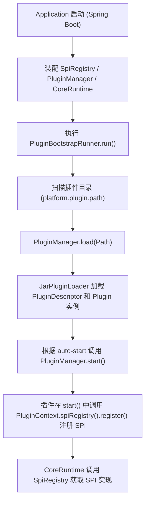

# Nexus Admin 插件化业务拓展平台后端

## 项目简介
**Nexus Admin** 是一个面向后台管理场景的 **插件化业务拓展平台后端**。

平台通过统一的核心模型与 SPI 抽象，将认证、权限、路由、存储、缓存、日志、AI 等能力解耦为接口，由插件或基础设施模块在运行时动态提供具体实现，从而实现：
- **低耦合**：业务能力通过接口抽象，与具体技术栈解耦。
- **高扩展**：新能力以 **插件** 形式无侵入接入，支持按需启停、热升级。
- **统一内核**：核心模块提供统一的运行时门面，对上层业务屏蔽实现细节。

---

## 模块结构
整个项目采用 Maven 多模块结构，顶层 POM 为聚合工程 `nexus-admin`：
- **nexus-admin-core**（核心模块）
- **nexus-admin-plugin**（插件系统模块）
- **nexus-admin-infra**（基础设施适配模块）
- **nexus-admin-app**（应用启动模块）
- **plugins**（插件聚合模块）

### nexus-admin-core（核心模块）
- **职责**：
    - 定义平台的核心领域模型（用户、角色、权限、字典、日志等）。
    - 定义平台能力的 SPI 接口（认证、权限、路由、存储、缓存、日志、AI 等）。
    - 提供统一的运行时门面 `CoreRuntime`。
    - 提供统一的调用上下文 `CoreContext` 与领域事件模型。

- **主要内容**：
    - **领域模型（domain）**：
        - **组织/身份**：Department、Position、User、Role、Permission 等。
        - **字典**：Dictionary、DictionaryItem。
        - **日志**：LogEntry、LogType、LogLevel、LogContext。

    - **调用上下文**：
        - **类**：`CoreContext`
        - **包含**：`tenantId`、`userId`、`traceId`、`aiSessionId`、`timestamp`、`attributes(Map<String,String>)`
        - **特点**：不可变对象 + Builder，线程安全、易传递。

    - **事件模型**：
        - DomainEvent、BaseDomainEvent、DomainEventPublisher。

    - **异常体系**：
        - CoreException、DomainException、SpiNotFoundException。

    - **SPI 抽象（核心接口）**：
        - **认证授权类**：
            - **AuthProvider**：认证接口。
            - **PermissionResolver**：权限决策接口。
        - **路由与流量控制**：
            - **RoutingPolicy**：路由策略决策。
        - **存储与缓存**：
            - **StorageProvider**：统一存储访问接口。
            - **CacheProvider**：缓存接口（get/put/evict）。
        - **日志**：
            - **LogWriter**：日志写入。
            - **LogQueryProvider**：日志查询。
            - **LogRetentionPolicy**：日志保留策略。
        - **AI 能力**：
            - **ChatProvider**：对话模型。
            - **RagProvider**：检索增强生成（RAG）。
            - **ToolExecutor**：工具调用执行。
            - **AgentPolicy**：智能体策略决策。
        - **SPI 注册中心接口**：
            - **SpiRegistry**：负责 SPI 实现的注册、查询与管理。

    - **核心运行时门面：CoreRuntime**：
        - 对上层暴露统一 API，对下通过 `SpiRegistry` 调用具体 SPI 实现。
        - **主要方法**：
            - **认证与授权**：
                - `authenticate(AuthRequest, CoreContext)`
                - `authorize(PermissionCheck, CoreContext)`
            - **路由**：
                - `route(RouteRequest, CoreContext)`
            - **存储与缓存**：
                - `load/save(StorageKey/StorageObject, CoreContext)`
                - `cacheGet/cachePut/cacheEvict(CacheKey, CacheValue, CoreContext)`
            - **AI**：
                - `chat(ChatRequest, CoreContext)`
                - `rag(RagRequest, CoreContext)`
                - `executeTool(ToolCall, CoreContext)`
                - `decideAgent(AgentRequest, CoreContext)`
            - **日志**：
                - `writeLog(LogEntry, CoreContext)`
                - 内部封装 `writeAuditLog`、`writeAiLog`，统一日志格式。

---

### nexus-admin-plugin（插件系统模块）
- **职责**：
    - 提供插件描述、加载、生命周期管理。
    - 实现 `SpiRegistry` 默认实现。
    - 作为插件与核心 SPI 之间的桥梁。

- **核心概念**：
    - **插件描述（PluginDescriptor）**
        - **配置文件**：`plugin.yml`
        - **字段**：
            - **id**：插件唯一标识（必填）
            - **version**：插件版本号（必填）
            - **mainClass**：插件入口类（可选；实现 `Plugin` 接口）
            - **provides**：插件提供的能力列表（字符串数组，自定义语义）
            - **metadata**：除上述字段外的所有原始配置键值对
        - **特点**：
            - 由 `PluginDescriptor.from(Map<String,Object>)` 从 YAML 原始 Map 构建。
            - 方法 `hasEntryPoint()` 判断是否有入口类。

    - **插件描述加载（PluginDescriptorLoader）**
        - 固定文件名：`plugin.yml`
        - 支持两种加载方式：
            - **目录模式**：`<plugin-dir>/plugin.yml`
            - **JAR 模式**：JAR 根路径下的 `plugin.yml`
        - 使用 `SnakeYAML` 解析 YAML。

    - **插件生命周期（Plugin）**
        - 接口定义：
            - `PluginDescriptor descriptor()`
            - `void start(PluginContext context)`
            - `void stop(PluginContext context)`
        - 状态枚举 `PluginState`：LOADED / STARTED / STOPPED / FAILED。

    - **插件上下文（PluginContext）**
        - **包含**：
            - `descriptor()`：插件描述。
            - `spiRegistry()`：平台 SPI 注册中心。
            - `classLoader()`：插件专属类加载器。
            - `pluginPath()`：插件路径（目录或 JAR）。
        - **用途**：
            - 插件在 `start/stop` 中通过 `spiRegistry()` 注册/注销 SPI 实现。
            - 可根据 `pluginPath` 访问插件自身资源。

    - **插件加载（PluginLoader / JarPluginLoader）**
        - **接口**：`PluginLoader`
            - `LoadedPlugin load(Path path, SpiRegistry registry)`
        - **默认实现**：`JarPluginLoader`
            - 步骤：
                - 使用 `PluginDescriptorLoader` 加载 `PluginDescriptor`。
                - 使用 `URLClassLoader` 以 `path` 为 URL 创建插件类加载器，父加载器为当前线程 ContextClassLoader。
                - 若 `descriptor.hasEntryPoint()`：
                    - 加载 `mainClass`，要求实现 `Plugin` 接口。
                    - 反射构造实例。
                - 封装为 `LoadedPlugin` 返回。

    - **已加载插件封装（LoadedPlugin）**
        - 持有：
            - `PluginDescriptor descriptor`
            - `Plugin plugin`
            - `ClassLoader classLoader`
            - `Path pluginPath`
            - `PluginState state`
        - 提供 `PluginContext createContext(SpiRegistry registry)` 快速创建上下文对象。

    - **插件管理器（PluginManager）**
        - **职责**：
            - 统一管理插件的加载、启动、停止、卸载。
            - 维护插件 ID 到 `LoadedPlugin` 的映射。
        - **主要方法**：
            - `LoadedPlugin load(Path path)`：加载插件并缓存在内部 Map 中。
            - `void start(String pluginId)`：调用插件 `start(context)`，状态标记为 STARTED。
            - `void stop(String pluginId)`：调用 `stop(context)`，状态标记为 STOPPED。
            - `void unload(String pluginId)`：如有必要先 stop，再关闭类加载器，最终移除插件。
            - `Collection<LoadedPlugin> list()`：列出所有已加载插件。

    - **SPI 注册中心默认实现（DefaultSpiRegistry）**
        - 实现接口：`SpiRegistry`
        - 内部结构：
            - `ConcurrentHashMap<Class<?>, CopyOnWriteArrayList<Object>> registry`
        - 功能：
            - **register**：按 SPI 类型追加实现（线程安全，支持多实现）。
            - **unregister**：移除指定实现。
            - **getAll**：返回类型安全副本，只包含 `spiType.isInstance(item)` 的对象。
            - **get**：返回第一个实现（无则 `Optional.empty()`）。

---

### nexus-admin-infra（基础设施模块）
- **职责**：
    - 承接 `nexus-admin-core` 中定义的 SPI，与具体技术栈（Spring Boot、Web、Redis、数据库、安全框架等）进行集成。
    - 提供拦截器、配置类、默认实现等基础设施层能力。

- **当前实现情况**：
    - **AI 配置**：
        - `AiInfraConfiguration`：空的 `@Configuration` 类，预留 AI SPI 的 Spring Bean 装配位置。
    - **日志配置**：
        - 日志拦截器（如 `HttpAccessInterceptor` 等）用于记录 HTTP 访问、AI 调用、鉴权决策。
        - `LoggingInfraConfiguration`：
            - 实现 `WebMvcConfigurer`。
            - 在 `addInterceptors` 中注册 `httpAccessInterceptor`，对所有路径 `/**` 生效。
    - **Web 配置**：
        - `WebInfraConfiguration`：空配置，预留 Web 层共用配置（CORS、统一异常处理等）。
    - **持久化配置**：
        - `PersistenceInfraConfiguration`：空配置，预留数据源、ORM、事务配置。
    - **安全配置**：
        - `SecurityInfraConfiguration`：空配置，预留安全相关配置（如 Spring Security）。

> 后续可在此模块中对核心 SPI 做默认实现（如使用 Redis 实现 CacheProvider，用 MyBatis-Flex 实现 StorageProvider 等）。

---

### nexus-admin-app（应用模块）
- **职责**：
    - 作为最终运行的 Spring Boot 应用，负责：
        - 扫描所有模块 Bean。
        - 装配插件系统、核心运行时与基础设施。
        - 启动时自动扫描并加载插件。

- **启动类**：
    - `Application`
        - 标注：`@SpringBootApplication(scanBasePackages = "com.nexusadmin")`
        - 作用：扫描 `core`、`plugin`、`infra`、`app` 等所有模块下的 Spring Bean。

- **插件与核心 Bean 组装**（PluginBootstrapConfiguration）：
    - `@Bean SpiRegistry spiRegistry()`：
        - 返回 `DefaultSpiRegistry` 作为全局 SPI 注册中心。
    - `@Bean PluginManager pluginManager(SpiRegistry registry)`：
        - 使用统一的 Registry 创建 PluginManager。
    - `@Bean CoreRuntime coreRuntime(SpiRegistry registry)`：
        - 使用同一 Registry 创建 CoreRuntime，保证核心运行时访问到插件注册的实现。

- **插件启动 Runner**（PluginBootstrapRunner）：
    - 实现 `ApplicationRunner`，在应用启动后执行插件加载逻辑。
    - 配置参数：
        - **platform.plugin.path**：插件目录，默认 `plugins`。
        - **platform.plugin.auto-start**：是否自动启动有入口点的插件，默认 `true`。
    - 运行流程：
        - 计算插件目录绝对路径，检查存在性。
        - 遍历目录下的子目录和 `.jar` 文件。
        - 对每个路径调用 `pluginManager.load(path)`。
        - 若 `autoStart = true` 且插件 `hasEntryPoint()`：
            - 调用 `pluginManager.start(pluginId)`。
        - 异常以日志形式记录，不影响整体平台启动。

---

### plugins（插件聚合模块）
- **职责**：
    - 作为逻辑上的“插件集合”工程，用于容纳多个插件子模块。
    - 当前 `<modules>` 为空，可以按需新增子模块。

- **建议使用方式**：
    - 在 `plugins` 下创建子模块（如 `sample-auth-plugin`）。
    - 子模块 POM 打包成 `jar`。
    - 打包产物统一输出到运行时配置的插件目录。

---

## 核心架构与调用关系

### 启动与插件加载流程


### 运行时调用路径（示意）
- 上层业务或控制器 → `CoreRuntime`（统一入口）
- `CoreRuntime` → `SpiRegistry.get(...)` / `getAll(...)` 查找 SPI 实现
- SPI 实现来源：
    - 插件在 `Plugin.start()` 中注册。
    - 或基础设施模块在启动过程中注册（未来扩展）。
- `CoreRuntime` 将 `CoreContext` 统一传递，用于日志/权限/多租户/追踪等。

---

## 插件开发指南（简要）

### 1. 插件工程结构建议
- 在 `plugins` 模块下创建子模块，例如 `sample-auth-plugin`：
    - **POM**：依赖 `nexus-admin-core`、其他需要的第三方库。
    - **打包方式**：`<packaging>jar</packaging>`。
    - 插件代码中可以直接引用 `AuthProvider`、`PermissionResolver`、`ChatProvider` 等 SPI 接口。

### 2. 编写 `plugin.yml`
`plugin.yml` 可放在插件 JAR 根路径，也可作为目录模式使用。示例：
```yaml
id: sample-auth
version: 1.0.0
mainClass: com.example.plugin.SampleAuthPlugin
provides:
  - auth
  - permission
label: "示例认证插件"
description: "提供基于 JWT 的认证与权限控制"
```
- **id** / **version** 为必填字段。
- **mainClass** 为插件入口类（实现 `Plugin` 接口）。
- **provides** 可用于对插件能力进行标记，具体语义由平台自定义。
- 其他字段会自动进入 `PluginDescriptor.metadata()`。

### 3. 实现插件入口类（Plugin）
示例结构（伪代码）：
```java
public class SampleAuthPlugin implements Plugin {
    @Override
    public PluginDescriptor descriptor() {
        // 通常可直接返回 PluginContext.descriptor()，也可以在内部缓存
        throw new UnsupportedOperationException("use descriptor from context");
    }

    @Override
    public void start(PluginContext context) {
        SpiRegistry registry = context.spiRegistry();

        // 注册认证实现
        registry.register(AuthProvider.class, new JwtAuthProvider(/* ... */));

        // 注册权限决策实现
        registry.register(PermissionResolver.class, new RbacPermissionResolver(/* ... */));

        // 其他 SPI 实现...
    }

    @Override
    public void stop(PluginContext context) {
        // 如有需要，可以调用 unregister 或释放资源
        // registry.unregister(AuthProvider.class, jwtAuthProviderInstance);
    }
}
```

### 4. 打包与部署
- 将插件项目打包为 JAR（包含 `plugin.yml`）。
- 在运行环境中配置：
    - `platform.plugin.path`（默认为 `plugins`）。
- 将插件 JAR 拷贝至插件目录：
    - 例如：`$WORKDIR/plugins/sample-auth-plugin-1.0.0.jar`。
- 重启或启动 `nexus-admin-app`：
    - 平台会自动扫描并加载插件，并根据 `platform.plugin.auto-start` 决定是否自动调用 `start()`。

---

## 配置与运行说明（概览）

### 1. 核心配置项
- **platform.plugin.path**
    - **说明**：插件根目录路径。
    - **默认值**：`plugins`
    - **示例**：
        ```yaml
        platform:
          plugin:
            path: plugins
        ```

- **platform.plugin.auto-start**
    - **说明**：是否自动启动具有 `mainClass` 的插件。
    - **默认值**：`true`
    - **示例**：
        ```yaml
        platform:
          plugin:
            auto-start: true
        ```

### 2. 运行方式
- 本地开发环境（示例）：
    - 使用 IDE 运行 `Application` 主类。
    - 在项目根目录下创建 `plugins` 目录，将插件 JAR/目录放入。
    - 观察日志中插件加载、启动信息。

---

## 后续扩展方向（建议）
- **完善默认基础设施实现**：
    - 在 `nexus-admin-infra` 中提供默认的：
        - AuthProvider / PermissionResolver（基于 JWT + RBAC）。
        - CacheProvider（基于 Redis）。
        - StorageProvider（基于关系型数据库 + MyBatis-Flex/MyBatis-Plus）。
        - LogWriter / LogQueryProvider（对接 ELK / OpenTelemetry）。
- **丰富插件生态**：
    - 常用业务插件：审计日志插件、多租户路由插件、AI 助手插件等。
    - 开放插件开发规范与示例仓库。
- **增强运维能力**：
    - 提供管理后台页面，动态查看已加载插件列表、状态（LOADED/STARTED/FAILED）、版本信息。
    - 支持插件在线启停、热升级。

---

> 本文档可作为本项目的 **顶层 README** 或 **设计说明文档** 使用：
> - 前半部分（项目简介、模块结构、架构与运行流程）适合作为 README。
> - 后半部分（插件开发指南、配置说明、扩展建议）可作为设计/开发文档，为团队成员或插件开发者提供参考。